# سند جامع شماتیک دیتابیس و روابط جداول (Database Schema & ERD - V2)
## اپلیکیشن یادگیری مکالمه انگلیسی: AiSpeaking Plus

---

## ۱. نمودار شماتیک ارتباطات پایگاه داده (Entity Relationship Diagram - ERD)

> [!TIP]
> 🎨 **دیاگرام گرافیکی و تعاملی کامل دیتابیس:**  
> فایل گرافیکی و مستقل این شماتیک با طراحی استاندارد تحریریه مهندسی در فایل **[DATABASE_SCHEMA_DIAGRAM.html](file:///Users/mahdi/StudioProjects/AISpeakingPlus/DATABASE_SCHEMA_DIAGRAM.html)** ایجاد شده است که می‌توانید آن را مستقیماً در مرورگر باز کنید.

نمودار زیر ساختار نهایی، سبک و بدون فیلدهای اضافه پایگاه داده رابطه‌ای نسخه ۲ را نشان می‌دهد (شامل ادغام استریک در جدول کاربران و حذف کامل متغیرهای زائد):

```mermaid
erDiagram
    USERS ||--o{ LEVEL_PROGRESS : "دارد (پیشرفت مراحل)"
    USERS ||--o{ PURCHASES : "انجام می‌دهد (تراکنش خرید)"
    USERS ||--o{ USER_DEVICE_TOKENS : "دارد (توکن‌های نوتیفیکیشن)"
    
    LEVELS ||--o{ LEVEL_PROGRESS : "ثبت می‌شود برای"
    
    PLANS ||--o{ PURCHASES : "خریداری می‌شود در"
    
    DISCOUNT_CODES ||--o{ PURCHASES : "اعمال می‌شود روی"

    USERS {
        uuid id PK "شناسه یکتا کاربر"
        varchar(11) phone_number UK "شماره موبایل (منحصربه‌فرد)"
        varchar(50) first_name "نام (اختیاری)"
        varchar(50) last_name "نام خانوادگی (اختیاری)"
        int current_level "بالاترین مرحله آنلاک‌شده (پیش‌فرض: ۱)"
        int total_stars "مجموع ستاره‌های کسب‌شده"
        int streak_days "شمارنده روزهای متوالی تمرین"
        date last_active_date "تاریخ آخرین روز تمرین کاربر"
        boolean is_active "وضعیت فعال بودن اکانت"
        timestamp created_at "تاریخ ایجاد حساب"
        timestamp updated_at "تاریخ آخرین به‌روزرسانی"
    }

    LEVELS {
        uuid id PK "شناسه یکتا مرحله"
        int level_number UK "شماره ترتیبی مرحله (۱، ۲، ۳...)"
        varchar(255) title_en "عنوان انگلیسی مرحله"
        varchar(255) title_fa "عنوان فارسی مرحله"
        text briefing_en "متن داستان سناریو به انگلیسی"
        text briefing_fa "متن داستان سناریو به فارسی (جهت نمایش در اپ)"
        text mission_goal_en "شرط پیروزی ماموریت برای هوش مصنوعی"
        text mission_goal_fa "هدف ماموریت برای کاربر"
        varchar(10) starter "آغازگر گفتگو (USER یا NPC)"
        varchar(100) npc_name "نام کاراکتر هوش مصنوعی"
        varchar(100) npc_role "نقش کاراکتر در سناریو"
        varchar(10) npc_gender "جنسیت کاراکتر (MALE یا FEMALE)"
        int npc_voice_id "شناسه صدای کاراکتر در Kokoro"
        boolean is_active "وضعیت فعال بودن مرحله"
        timestamp created_at "تاریخ ایجاد"
        timestamp updated_at "تاریخ به‌روزرسانی"
    }

    LEVEL_PROGRESS {
        uuid id PK "شناسه یکتا سابقه پیشرفت"
        uuid user_id FK "کلید خارجی به جدول USERS"
        uuid level_id FK "کلید خارجی به جدول LEVELS"
        int stars "بیشترین ستاره ثبت‌شده برای این مرحله (۱ تا ۳)"
        int hints_used "تعداد دفعات استفاده از راهنما در بهترین تلاش"
        int grammar_errors_count "تعداد خطاهای گرامری در بهترین تلاش"
        timestamp completed_at "تاریخ اولین قبولی مرحله"
        timestamp updated_at "تاریخ آخرین تلاش و ارتقای رکورد"
    }

    PLANS {
        uuid id PK "شناسه یکتا پلن اشتراک"
        varchar(50) name UK "شناسه سیستمی (1_MONTH, 3_MONTHS, 6_MONTHS)"
        varchar(100) title "عنوان نمایشی پلن به فارسی"
        int day_duration "طول مدت اشتراک به روز (۳۰، ۹۰، ۱۸۰)"
        bigint original_price "قیمت پایه خط‌خورده به ریال"
        bigint discounted_price "قیمت پرداختی با تخفیف به ریال"
        varchar(100) cafe_bazaar_sku "شناسه محصول در کافه‌بازار"
        varchar(50) badge_text "نشان تبلیغاتی (محبوب‌ترین، بیشترین تخفیف)"
        boolean is_active "وضعیت فعال بودن پلن"
        timestamp created_at "تاریخ ایجاد"
    }

    DISCOUNT_CODES {
        uuid id PK "شناسه یکتا کد تخفیف"
        varchar(30) code UK "متن کد تخفیف (یکتا)"
        int percentage "درصد تخفیف (بین ۱ تا ۱۰۰)"
        bigint max_discount_amount "سقف تخفیف به ریال (اختیاری)"
        timestamp expires_at "تاریخ انقضای کد تخفیف"
        int max_usage "حداکثر دفعات مجاز استفاده"
        int used_count "تعداد دفعات استفاده‌شده"
        boolean is_active "وضعیت فعال بودن کد"
        timestamp created_at "تاریخ ایجاد"
    }

    PURCHASES {
        uuid id PK "شناسه یکتا فاکتور خرید"
        uuid user_id FK "کلید خارجی به جدول USERS"
        uuid plan_id FK "کلید خارجی به جدول PLANS"
        uuid discount_code_id FK "کلید خارجی کد تخفیف (اختیاری)"
        varchar(20) gateway "درگاه پرداخت (CAFE_BAZAAR, ZARINPAL, GIFT)"
        varchar(255) transaction_token "توکن رهگیری تراکنش یا توکن بازار"
        bigint amount_paid "مبلغ نهایی پرداخت‌شده به ریال"
        varchar(20) status "وضعیت (PENDING, SUCCESS, FAILED)"
        timestamp starts_at "تاریخ شروع دوره اشتراک"
        timestamp expires_at "تاریخ پایان اعتبار اشتراک"
        timestamp created_at "تاریخ ایجاد تراکنش"
    }

    USER_DEVICE_TOKENS {
        uuid id PK "شناسه یکتا توکن"
        uuid user_id FK "کلید خارجی به جدول USERS"
        varchar(255) fcm_token "توکن سرویس Firebase FCM"
        varchar(20) platform "نوع دستگاه (ANDROID, IOS, WEB)"
        timestamp updated_at "زمان آخرین ثبت یا تمدید"
    }
```



---

## ۲. مشخصات تفصیلی جداول پالایش‌شده (Refined Table Specifications)

---

### ۲.۱. جدول کاربران (`users`)
پروفایل کاربری، سطح پیشرفت در نقشه و وضعیت استریک روزانه در یک جدول واحد و سبک تجمیع شده است.

* **نام جدول:** `users`
* **کلاس Exposed ORM:** `object UserTable : UUIDTable("users")`

| نام ستون | نوع داده PostgreSQL | نوع در Exposed | Nullable | کلید / ایندکس | مقدار پیش‌فرض | توضیحات و منطق بیزنس |
| :--- | :--- | :--- | :---: | :---: | :--- | :--- |
| `id` | `UUID` | `uuid("id")` | خیر | **PK** | `gen_random_uuid()` | شناسه یکتای کاربر |
| `phone_number` | `VARCHAR(11)` | `varchar("phone_number", 11)` | خیر | **UK** | ندارد | شماره موبایل کاربر (فرمت: `09xxxxxxxxx`) |
| `first_name` | `VARCHAR(50)` | `varchar("first_name", 50)` | بله | ندارد | `NULL` | نام کاربر (اختیاری) |
| `last_name` | `VARCHAR(50)` | `varchar("last_name", 50)` | بله | ندارد | `NULL` | نام خانوادگی کاربر (اختیاری) |
| `current_level` | `INT` | `integer("current_level")` | خیر | ندارد | `1` | شماره بالاترین مرحله در دسترس |
| `total_stars` | `INT` | `integer("total_stars")` | خیر | **Index (DESC)** | `0` | مجموع کل ستاره‌های کسب‌شده (معیار اصلی رتبه‌بندی) |
| `streak_days` | `INT` | `integer("streak_days")` | خیر | ندارد | `0` | تعداد روزهای متوالی تمرین روزانه (آیکون 🔥) |
| `last_active_date` | `DATE` | `date("last_active_date")` | بله | ندارد | `NULL` | تاریخ آخرین روز تمرین جهت محاسبه استریک |
| `is_active` | `BOOLEAN` | `bool("is_active")` | خیر | ندارد | `true` | وضعیت فعال بودن حساب کاربری |
| `created_at` | `TIMESTAMP WITH TIME ZONE` | `timestamp("created_at")` | خیر | ندارد | `Clock.System.now()` | زمان ایجاد حساب |
| `updated_at` | `TIMESTAMP WITH TIME ZONE` | `timestamp("updated_at")` | خیر | ندارد | `Clock.System.now()` | زمان آخرین ویرایش |

> **نکات پالایش:**  
> * فیلدهای منسوخ `gender`, `avatar_url`, `total_score` و `display_name` حذف شدند. اگر نام و نام‌خانوادگی خالی باشد، کد سرور نام نمایشی پیش‌فرض `Learner_` + ۴ رقم آخر شماره موبایل را بازمی‌گرداند.  
> * جدول جداگانه `user_streaks` به دو ستون سبک `streak_days` و `last_active_date` تبدیل و مستقیماً داخل `users` ادغام شد (حذف یک جدول اضافی).

---

### ۲.۲. جدول مراحل و سناریوها (`levels`)
فقط متغیرهای حیاتی مرحله و ماموریت داستانی را نگهداری می‌کند و هیچ پرامپت تکراری یا داده‌های استاتیک کلاینت در آن ذخیره نمی‌شود.

* **نام جدول:** `levels`
* **کلاس Exposed ORM:** `object LevelTable : UUIDTable("levels")`

| نام ستون | نوع داده PostgreSQL | نوع در Exposed | Nullable | کلید / ایندکس | مقدار پیش‌فرض | توضیحات و منطق بیزنس |
| :--- | :--- | :--- | :---: | :---: | :--- | :--- |
| `id` | `UUID` | `uuid("id")` | خیر | **PK** | `gen_random_uuid()` | شناسه یکتای مرحله |
| `level_number` | `INT` | `integer("level_number")` | خیر | **UK** | ندارد | شماره ترتیبی مرحله (۱، ۲، ۳، ...) |
| `title_en` | `VARCHAR(255)` | `varchar("title_en", 255)` | خیر | ندارد | ندارد | عنوان مرحله به انگلیسی |
| `title_fa` | `VARCHAR(255)` | `varchar("title_fa", 255)` | خیر | ندارد | ندارد | عنوان مرحله به فارسی |
| `briefing_en` | `TEXT` | `text("briefing_en")` | خیر | ندارد | ندارد | شرح داستان ماموریت برای کاربر به انگلیسی |
| `briefing_fa` | `TEXT` | `text("briefing_fa")` | خیر | ندارد | ندارد | شرح داستان ماموریت به فارسی |
| `mission_goal_en` | `TEXT` | `text("mission_goal_en")` | خیر | ندارد | ندارد | شرط پیروزی مرحله برای ارزیابی هوش مصنوعی |
| `mission_goal_fa` | `TEXT` | `text("mission_goal_fa")` | خیر | ندارد | ندارد | هدف ماموریت برای نمایش به کاربر |
| `starter` | `VARCHAR(10)` | `varchar("starter", 10)` | خیر | ندارد | `'USER'` | چه کسی شروع می‌کند (`USER` یا `NPC`) |
| `npc_name` | `VARCHAR(100)` | `varchar("npc_name", 100)` | خیر | ندارد | ندارد | نام کاراکتر هوش مصنوعی (مانند Mr. George) |
| `npc_role` | `VARCHAR(100)` | `varchar("npc_role", 100)` | خیر | ندارد | ندارد | نقش کاراکتر (مانند Grocery Store Owner) |
| `npc_gender` | `VARCHAR(10)` | `varchar("npc_gender", 10)` | خیر | ندارد | `'MALE'` | جنسیت کاراکتر (`MALE` یا `FEMALE`) |
| `npc_voice_id` | `INT` | `integer("npc_voice_id")` | خیر | ندارد | `0` | شناسه دقیق صدا در موتور صوتی Kokoro-82M |
| `is_active` | `BOOLEAN` | `bool("is_active")` | خیر | ندارد | `true` | وضعیت فعال بودن مرحله در نقشه بازی |
| `created_at` | `TIMESTAMP WITH TIME ZONE` | `timestamp("created_at")` | خیر | ندارد | `Clock.System.now()` | زمان ایجاد مرحله |
| `updated_at` | `TIMESTAMP WITH TIME ZONE` | `timestamp("updated_at")` | خیر | ندارد | `Clock.System.now()` | زمان آخرین ویرایش |

> **نکات پالایش:**  
> * فیلدهای `npc_avatar_url`, `npc_initial_message_en`, `npc_initial_message_fa`, `base_score`, `access_tier` و `system_prompt` به طور کامل حذف شدند. پرامپت‌ها از طریق قالب ثابت در کد با این متغیرها پر می‌شوند.

---

### ۲.۳. جدول پیشرفت و رکوردهای مراحل (`level_progress`)
ثبت دستاوردهای هر کاربر به تفکیک مرحله با تضمین حفظ بالاترین ستاره کسب‌شده.

* **نام جدول:** `level_progress`
* **کلاس Exposed ORM:** `object LevelProgressTable : UUIDTable("level_progress")`

| نام ستون | نوع داده PostgreSQL | نوع در Exposed | Nullable | کلید / ایندکس | رفتار Cascade | توضیحات |
| :--- | :--- | :--- | :---: | :---: | :--- | :--- |
| `id` | `UUID` | `uuid("id")` | خیر | **PK** | ندارد | شناسه رکورد پیشرفت |
| `user_id` | `UUID` | `uuid("user_id")` | خیر | **FK** | `ON DELETE CASCADE` | ارجاع به `users.id` |
| `level_id` | `UUID` | `uuid("level_id")` | خیر | **FK** | `ON DELETE RESTRICT` | ارجاع به `levels.id` |
| `stars` | `INT` | `integer("stars")` | خیر | ندارد | ندارد | **بیشترین ستاره ثبت‌شده برای این مرحله (۱ تا ۳)** |
| `hints_used` | `INT` | `integer("hints_used")` | خیر | ندارد | ندارد | تعداد راهنماهای مصرف‌شده در بهترین تلاش |
| `grammar_errors_count`| `INT` | `integer("grammar_errors_count")`| خیر | ندارد | ندارد | تعداد خطاهای گرامری در بهترین تلاش |
| `completed_at` | `TIMESTAMP WITH TIME ZONE` | `timestamp("completed_at")` | خیر | ندارد | ندارد | تاریخ اولین اتمام موفق مرحله |
| `updated_at` | `TIMESTAMP WITH TIME ZONE` | `timestamp("updated_at")` | خیر | ندارد | ندارد | تاریخ آخرین ارتقای ستاره |

#### قیدها و ایندکس‌ها:
* `uk_user_level_progress`: قید یکتایی ترکیبی `UNIQUE(user_id, level_id)`.
* `idx_level_progress_user`: ایندکس روی `user_id` برای بارگذاری فوری تاریخچه مراحل بازی‌شده.

> **نکات پالایش:**  
> * فیلدهای `score`, `best_score`, `best_stars` و `duration_seconds` حذف و ساده‌سازی شدند؛ ستون `stars` به تنهایی نماینده بالاترین رکورد کاربر است.

---

### ۲.۴. جدول پلن‌های اشتراک (`plans`)
تعریف پلن‌های استاندارد سه‌گانه خرید اشتراک حساب ویژه.

* **نام جدول:** `plans`
* **کلاس Exposed ORM:** `object PlanTable : UUIDTable("plans")`

| نام ستون | نوع داده PostgreSQL | نوع در Exposed | Nullable | کلید / ایندکس | توضیحات |
| :--- | :--- | :--- | :---: | :---: | :--- |
| `id` | `UUID` | `uuid("id")` | خیر | **PK** | شناسه پلن |
| `name` | `VARCHAR(50)` | `varchar("name", 50)` | خیر | **UK** | نام سیستمی (`1_MONTH`, `3_MONTHS`, `6_MONTHS`) |
| `title` | `VARCHAR(100)` | `varchar("title", 100)` | خیر | ندارد | عنوان نمایشی فارسی (مثلاً: اشتراک ۳ ماهه) |
| `day_duration` | `INT` | `integer("day_duration")` | خیر | ندارد | مدت اعتبار به روز (۳۰، ۹۰، ۱۸۰) |
| `original_price` | `BIGINT` | `long("original_price")` | خیر | ندارد | قیمت خط‌خورده پایه به ریال (۹۹۰,۰۰۰ تا ۴,۹۰۰,۰۰۰) |
| `discounted_price`| `BIGINT` | `long("discounted_price")` | خیر | ندارد | قیمت با تخفیف اولیه به ریال (۵۹۰,۰۰۰ تا ۲,۹۰۰,۰۰۰) |
| `cafe_bazaar_sku` | `VARCHAR(100)` | `varchar("cafe_bazaar_sku", 100)` | خیر | ندارد | شناسه SKU در کنسول کافه‌بازار |
| `badge_text` | `VARCHAR(50)` | `varchar("badge_text", 50)` | بله | ندارد | نشان تبلیغاتی («محبوب‌ترین»، «بیشترین تخفیف») |
| `is_active` | `BOOLEAN` | `bool("is_active")` | خیر | ندارد | وضعیت فعال بودن پلن برای فروش |
| `created_at` | `TIMESTAMP WITH TIME ZONE` | `timestamp("created_at")` | خیر | ندارد | تاریخ ایجاد پلن |

---

### ۲.۵. جدول کدهای تخفیف (`discount_codes`)
مدیریت کوپن‌های تخفیف با درصد، سقف، انقضا و ظرفیت مصرف عمومی روی تمام بسته‌ها.

* **نام جدول:** `discount_codes`
* **کلاس Exposed ORM:** `object DiscountCodeTable : UUIDTable("discount_codes")`

| نام ستون | نوع داده PostgreSQL | نوع در Exposed | Nullable | کلید / ایندکس | مقدار پیش‌فرض | توضیحات |
| :--- | :--- | :--- | :---: | :---: | :--- | :--- |
| `id` | `UUID` | `uuid("id")` | خیر | **PK** | `gen_random_uuid()` | شناسه کد تخفیف |
| `code` | `VARCHAR(30)` | `varchar("code", 30)` | خیر | **UK** | ندارد | متن کد تخفیف با حروف بزرگ |
| `percentage` | `INT` | `integer("percentage")` | خیر | ندارد | ندارد | درصد تخفیف (بین ۱ تا ۱۰۰) |
| `max_discount_amount`| `BIGINT`| `long("max_discount_amount")`| بله | ندارد | `NULL` | حداکثر سقف تخفیف به ریال (اختیاری) |
| `expires_at` | `TIMESTAMP WITH TIME ZONE` | `timestamp("expires_at")` | خیر | ایندکس | ندارد | تاریخ پایان مهلت اعتبار کد تخفیف |
| `max_usage` | `INT` | `integer("max_usage")` | خیر | ندارد | `1000` | سقف دفعات استفاده مجاز |
| `used_count` | `INT` | `integer("used_count")` | خیر | ندارد | `0` | تعداد دفعات ثبت‌شده تاکنون |
| `is_active` | `BOOLEAN` | `bool("is_active")` | خیر | ندارد | `true` | وضعیت فعال بودن عمومی کد |
| `created_at` | `TIMESTAMP WITH TIME ZONE` | `timestamp("created_at")` | خیر | ندارد | `Clock.System.now()` | تاریخ ایجاد کد |

> **نکات پالایش:**  
> * ستون‌های اضافی `valid_from` (چون کد از لحظه ساخت معتبر است) و `applicable_plan_ids` (چون در اپ ۳ پلنی تخفیف‌ها سراسری هستند) حذف شدند.

---

### ۲.۶. جدول فاکتورها و خریدهای اشتراک (`purchases`)
ثبت سوابق خرید و فعال‌سازی اشتراک جهت کنترل دسترسی به Paywall مرحله ۳ به بعد.

* **نام جدول:** `purchases`
* **کلاس Exposed ORM:** `object PurchaseTable : UUIDTable("purchases")`

| نام ستون | نوع داده PostgreSQL | نوع در Exposed | Nullable | کلید / ایندکس | رفتار Cascade | توضیحات |
| :--- | :--- | :--- | :---: | :---: | :--- | :--- |
| `id` | `UUID` | `uuid("id")` | خیر | **PK** | ندارد | شناسه فاکتور خرید |
| `user_id` | `UUID` | `uuid("user_id")` | خیر | **FK** | `ON DELETE CASCADE` | شناسه کاربر خریدار |
| `plan_id` | `UUID` | `uuid("plan_id")` | خیر | **FK** | `ON DELETE RESTRICT` | شناسه پلن خریداری‌شده |
| `discount_code_id` | `UUID` | `uuid("discount_code_id")` | بله | **FK** | `ON DELETE SET NULL` | شناسه کد تخفیف مصرف‌شده |
| `gateway` | `VARCHAR(20)` | `varchar("gateway", 20)` | خیر | ندارد | ندارد | درگاه (`CAFE_BAZAAR`, `ZARINPAL`, `GIFT`) |
| `transaction_token`| `VARCHAR(255)`| `varchar("transaction_token", 255)`| خیر| **UK** | ندارد | توکن خرید کافه‌بازار یا شناسه درگاه |
| `amount_paid` | `BIGINT` | `long("amount_paid")` | خیر | ندارد | ندارد | مبلغ نهایی پرداخت‌شده به ریال |
| `status` | `VARCHAR(20)` | `varchar("status", 20)` | خیر | ایندکس | `'PENDING'` | وضعیت (`PENDING`, `SUCCESS`, `FAILED`) |
| `starts_at` | `TIMESTAMP WITH TIME ZONE` | `timestamp("starts_at")` | بله | ندارد | `NULL` | تاریخ شروع اعتبار روزشمار |
| `expires_at` | `TIMESTAMP WITH TIME ZONE` | `timestamp("expires_at")` | بله | **Index** | `NULL` | **تاریخ پایان اعتبار اشتراک جهت فیلتر Paywall** |
| `created_at` | `TIMESTAMP WITH TIME ZONE` | `timestamp("created_at")` | خیر | ندارد | `Clock.System.now()` | تاریخ ایجاد تراکنش |

#### ایندکس‌های حیاتی جدول `purchases`:
* `idx_purchases_user_active_sub`: ایندکس ترکیبی روی `(user_id, status, expires_at DESC)` برای استعلام بلادرنگ وضعیت اشتراک کاربر.

> **نکات پالایش:**  
> * ستون‌های تکراری `reference_id` (در `transaction_token` ادغام شد) و `purchase_date` (در `created_at` ادغام شد) حذف شدند.

---

### ۲.۷. جدول توکن‌های دستگاه کاربر (`user_device_tokens`)
نگهداری توکن‌های FCM دستگاه‌های کاربر جهت ارسال نوتیفیکیشن‌های یادآوری روزانه.

* **نام جدول:** `user_device_tokens`
* **کلاس Exposed ORM:** `object UserDeviceTokenTable : UUIDTable("user_device_tokens")`

| نام ستون | نوع داده PostgreSQL | نوع در Exposed | Nullable | کلید / ایندکس | توضیحات |
| :--- | :--- | :--- | :---: | :---: | :--- |
| `id` | `UUID` | `uuid("id")` | خیر | **PK** | شناسه رکورد |
| `user_id` | `UUID` | `uuid("user_id")` | خیر | **FK** | ارجاع به `users.id` (ON DELETE CASCADE) |
| `fcm_token` | `VARCHAR(255)` | `varchar("fcm_token", 255)` | خیر | **Index** | توکن پوش سرویس Firebase FCM |
| `platform` | `VARCHAR(20)` | `varchar("platform", 20)` | خیر | ندارد | پلتفرم (`ANDROID`, `IOS`, `WEB`) |
| `updated_at` | `TIMESTAMP WITH TIME ZONE` | `timestamp("updated_at")` | خیر | ندارد | تاریخ آخرین اتصال دستگاه |

---

## ۳. ساختار داده‌های حافظه‌ای در Redis (Redis In-Memory Key Schema)

```text
+------------------------------------+---------------+---------------+-------------------------------+
| کلید Redis (Key Pattern)           | ساختار داده   | طول عمر (TTL) | هدف کاربرد                   |
+------------------------------------+---------------+---------------+-------------------------------+
| auth:otp:{mobile}                  | Hash          | 120 ثانیه     | نگهداری کد ۵ رقمی و دفعات خطا |
| auth:cooldown:{mobile}             | String        | 60 ثانیه      | جلوگیری از ارسال مکرر پیامک   |
| auth:blocked:{mobile}              | String        | 300 ثانیه     | مسدودسازی پس از ۳ بار اشتباه   |
| active_sub:{userId}                | String (Epoch)| 60 دقیقه      | کش سریع بررسی Paywall مرحله ۳+|
| chat:{userId}:{levelId}            | Redis Stream  | 2 ساعت        | تاریخچه پیام‌های موقت نشست جاری|
| leaderboard:top10_cache            | String (JSON) | 60 ثانیه      | پاسخ بدون تاخیر جدول برترین‌ها |
| rate_limit:stt:{userId}            | Integer       | 60 ثانیه      | کنترل سقف باز کردن سوکت صدا    |
| lock:purchase:{transactionToken}   | Redisson Lock | 30 ثانیه      | جلوگیری از اعتبارسنجی همزمان   |
+------------------------------------+---------------+---------------+-------------------------------+
```

---

## ۴. اسکریپت بهینه‌سازی دیتابیس (DDL Migration Script)

```sql
-- ۱. ایجاد اکستنشن UUID
CREATE EXTENSION IF NOT EXISTS "uuid-ossp";

-- ۲. ساختار تمیز جدول کاربران
CREATE TABLE IF NOT EXISTS "users" (
    "id" UUID PRIMARY KEY DEFAULT gen_random_uuid(),
    "phone_number" VARCHAR(11) NOT NULL UNIQUE,
    "first_name" VARCHAR(50),
    "last_name" VARCHAR(50),
    "current_level" INT NOT NULL DEFAULT 1,
    "total_stars" INT NOT NULL DEFAULT 0,
    "streak_days" INT NOT NULL DEFAULT 0,
    "last_active_date" DATE,
    "is_active" BOOLEAN NOT NULL DEFAULT TRUE,
    "created_at" TIMESTAMPTZ NOT NULL DEFAULT NOW(),
    "updated_at" TIMESTAMPTZ NOT NULL DEFAULT NOW()
);

-- ۳. ایندکس مرتب‌سازی لیدربورد بر اساس ستاره‌ها و مراحل
CREATE INDEX IF NOT EXISTS "idx_users_leaderboard" 
ON "users" ("total_stars" DESC, "current_level" DESC, "created_at" ASC);
```
