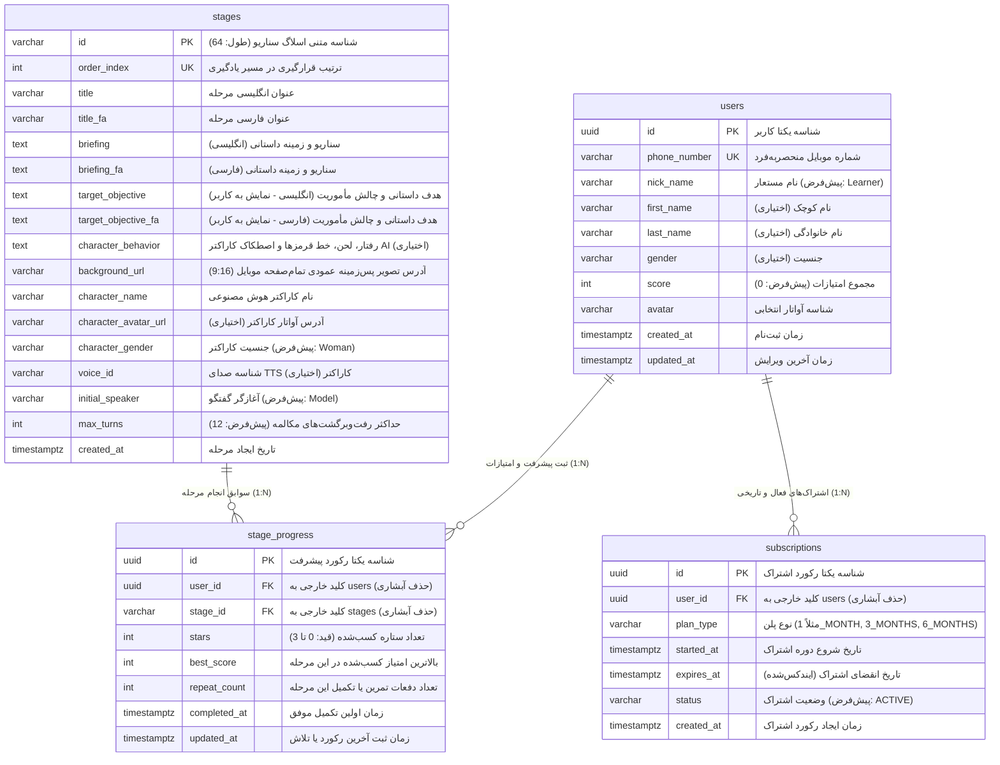

# سند جامع ساختار پایگاه داده و ارتباطات جداول (Database Schema & ERD)
## اپلیکیشن مکالمه هوشمند انگلیسی: AiSpeaking Plus

---

> [!TIP]
> 🎨 **دیاگرام گرافیکی و تعاملی پایگاه داده:**
> نسخه گرافیکی، برداری و تفصیلی این ارتباطات با طراحی مهندسی، انحنای استاندارد اتصالات، برچسب‌های ماسک‌شده و کارت‌های مشخصات در فایل **[DATABASE_SCHEMA_DIAGRAM.html](file:///Users/mahdi/StudioProjects/AISpeakingPlus/DATABASE_SCHEMA_DIAGRAM.html)** قرار دارد که می‌توانید آن را در هر مرورگری باز و مشاهده کنید.

---

## ۱. دیاگرام روابط موجودیت‌ها (Entity Relationship Diagram - ERD)

این ساختار منطبق با پیاده‌سازی رسمی کدهای سرور (`server/src/main/kotlin/ir/speaking/core/Databases.kt`) و جداول فریم‌ورک **Exposed ORM** است:

---

## ۲. مشخصات تفصیلی جداول (Table Specifications)

### ۲.۱. جدول کاربران (`users`)
نگهداری هویت، اطلاعات پروفایل کاربری، شماره تلفن احرازشده با OTP و جمع امتیازات کاربر.

* **نام جدول در دیتابیس:** `users`
* **کلاس در Exposed ORM:** [`UserTable`](file:///Users/mahdi/StudioProjects/AISpeakingPlus/server/src/main/kotlin/ir/speaking/feature/user/db/UserTable.kt) (ارث‌بری از `UUIDTable`)

| نام ستون | نوع در PostgreSQL | نوع در Exposed | Nullable | کلید / ایندکس | مقدار پیش‌فرض | توضیحات بیزنس |
| :--- | :--- | :--- | :---: | :---: | :--- | :--- |
| `id` | `UUID` | `UUIDTable.id` | خیر | **PK** | خودکار (UUIDv4) | شناسه یکتای اختصاصی کاربر |
| `phone_number` | `VARCHAR(20)` | `varchar("phone_number", 20)` | خیر | **UK** | ندارد | شماره موبایل کاربر (کلید احراز هویت پیامکی) |
| `nick_name` | `VARCHAR(100)` | `varchar("nick_name", 100)` | خیر | عادی | `'Learner'` | نام نمایشی کاربر در پروفایل و لیدربورد |
| `first_name` | `VARCHAR(100)` | `varchar("first_name", 100)` | بله | عادی | `NULL` | نام واقعی کاربر (اختیاری) |
| `last_name` | `VARCHAR(100)` | `varchar("last_name", 100)` | بله | عادی | `NULL` | نام خانوادگی کاربر (اختیاری) |
| `gender` | `VARCHAR(16)` | `varchar("gender", 16)` | بله | عادی | `NULL` | جنسیت کاربر (`Male`, `Female` و...) |
| `score` | `INT` | `integer("score")` | خیر | عادی | `0` | مجموع امتیازات کسب‌شده در چالش‌ها |
| `avatar` | `VARCHAR(255)` | `varchar("avatar", 255)` | خیر | عادی | `'default_avatar'` | کلید یا نام آواتار انتخاب‌شده |
| `created_at` | `TIMESTAMPTZ` | `timestamp("created_at")` | خیر | عادی | `CurrentTimestamp` | زمان ثبت نام و ساخت حساب |
| `updated_at` | `TIMESTAMPTZ` | `timestamp("updated_at")` | خیر | عادی | `CurrentTimestamp` | زمان آخرین ویرایش پروفایل |

---

### ۲.۲. جدول مراحل و سناریوهای داستانی (`stages`)
مراحل سناریومحور یادگیری مکالمه انگلیسی (سفر از فرودگاه، تاکسی، هتل و...). در هنگام راه‌اندازی سرور به صورت خودکار با اطلاعات اولیه (`StageSeedData`) مقداردهی می‌شود.

* **نام جدول در دیتابیس:** `stages`
* **کلاس در Exposed ORM:** [`StageTable`](file:///Users/mahdi/StudioProjects/AISpeakingPlus/server/src/main/kotlin/ir/speaking/feature/stage/db/StageTable.kt) (ارث‌بری از `IdTable<String>`)

| نام ستون | نوع در PostgreSQL | نوع در Exposed | Nullable | کلید / ایندکس | مقدار پیش‌فرض | توضیحات بیزنس |
| :--- | :--- | :--- | :---: | :---: | :--- | :--- |
| `id` | `VARCHAR(64)` | `varchar("id", 64).entityId()` | خیر | **PK** | ندارد | شناسه اسلاگ یکتای مرحله (مانند: `stage-01-tehran-departure`) |
| `order_index` | `INT` | `integer("order_index")` | خیر | **UK** | ندارد | ترتیب مرحله در نقشه بازی (۱، ۲، ۳، ...) |
| `title` | `VARCHAR(255)` | `varchar("title", 255)` | خیر | عادی | ندارد | عنوان انگلیسی مرحله |
| `title_fa` | `VARCHAR(255)` | `varchar("title_fa", 255)` | خیر | عادی | ندارد | عنوان فارسی مرحله |
| `briefing` | `TEXT` | `text("briefing")` | خیر | عادی | ندارد | شرح ماموریت و موقعیت به زبان انگلیسی |
| `briefing_fa` | `TEXT` | `text("briefing_fa")` | خیر | عادی | ندارد | شرح ماموریت و موقعیت به زبان فارسی |
| `target_objective` | `TEXT` | `text("target_objective")` | خیر | عادی | ندارد | هدف داستانی و چالش مأموریت به انگلیسی (نمایش در کلاینت) |
| `target_objective_fa` | `TEXT` | `text("target_objective_fa")` | خیر | عادی | ندارد | هدف داستانی و چالش مأموریت به فارسی (نمایش در کلاینت) |
| `character_behavior` | `TEXT` | `text("character_behavior")` | بله | عادی | `NULL` | پرامپت رفتار، موانع داستانی، راستی‌آزمایی و لحن کاراکتر هوش مصنوعی |
| `background_url` | `VARCHAR(512)` | `varchar("background_url", 512)` | خیر | عادی | ندارد | آدرس تصویر پس‌زمینه عمودی تمام‌صفحه موبایل (نسبت ۹:۱۶ مناسب گوشی) |
| `character_name` | `VARCHAR(128)` | `varchar("character_name", 128)` | خیر | عادی | ندارد | نام هوش مصنوعی هم‌صحبت (مانند Sara, Officer) |
| `character_avatar_url` | `VARCHAR(512)` | `varchar("character_avatar_url", 512)` | بله | عادی | `NULL` | آدرس تصویر آواتار کاراکتر |
| `character_gender` | `VARCHAR(16)` | `varchar("character_gender", 16)` | خیر | عادی | `'Woman'` | جنسیت کاراکتر (`Woman`, `Man`) |
| `voice_id` | `VARCHAR(64)` | `varchar("voice_id", 64)` | بله | عادی | `NULL` | شناسه صدای TTS در موتور تولید صوت |
| `initial_speaker` | `VARCHAR(16)` | `varchar("initial_speaker", 16)` | خیر | عادی | `'Model'` | گوینده آغازکننده مکالمه (`Model` یا `User`) |
| `max_turns` | `INT` | `integer("max_turns")` | خیر | عادی | `12` | سقف تعداد نوبت‌های تبادل پیام در این سناریو |
| `created_at` | `TIMESTAMPTZ` | `timestamp("created_at")` | خیر | عادی | `CurrentTimestamp` | زمان ایجاد رکورد مرحله |

---

### ۲.۳. جدول پیشرفت و رکوردهای مرحله (`stage_progress`)
ثبت ستاره‌ها، بالاترین امتیاز و تعداد دفعات اجرای هر مرحله توسط کاربر.

* **نام جدول در دیتابیس:** `stage_progress`
* **کلاس در Exposed ORM:** [`StageProgressTable`](file:///Users/mahdi/StudioProjects/AISpeakingPlus/server/src/main/kotlin/ir/speaking/feature/stage_progress/db/StageProgressTable.kt) (ارث‌بری از `UUIDTable`)

| نام ستون | نوع در PostgreSQL | نوع در Exposed | Nullable | کلید / ایندکس | رفتار Cascade | توضیحات بیزنس |
| :--- | :--- | :--- | :---: | :---: | :---: | :--- |
| `id` | `UUID` | `UUIDTable.id` | خیر | **PK** | — | شناسه یکتای رکورد پیشرفت |
| `user_id` | `UUID` | `reference("user_id", UserTable)` | خیر | **FK** | `ON DELETE CASCADE` | ارجاع به کاربر (`users.id`) |
| `stage_id` | `VARCHAR(64)` | `reference("stage_id", StageTable)` | خیر | **FK** | `ON DELETE CASCADE` | ارجاع به مرحله (`stages.id`) |
| `stars` | `INT` | `integer("stars")` | خیر | **CHECK** | — | ستاره‌های کسب‌شده (قید: `0 <= stars <= 3`) |
| `best_score` | `INT` | `integer("best_score")` | خیر | عادی | — | بیشترین امتیاز کسب‌شده در این مرحله (پیش‌فرض: `0`) |
| `repeat_count` | `INT` | `integer("repeat_count")` | خیر | عادی | — | تعداد دفعات تمرین یا تکمیل (پیش‌فرض: `1`) |
| `completed_at` | `TIMESTAMPTZ` | `timestamp("completed_at")` | خیر | عادی | — | زمان اتمام مرحله (پیش‌فرض: زمان جاری) |
| `updated_at` | `TIMESTAMPTZ` | `timestamp("updated_at")` | خیر | عادی | — | زمان آخرین تلاش یا ثبت امتیاز جدید |

#### قیدها و ایندکس‌های جدول `stage_progress`:
1. **ایندکس یکتای ترکیبی:** `idx_stage_progress_user_stage` بر روی `(user_id, stage_id)`. هر کاربر برای هر مرحله حداکثر یک سطر سابقه پیشرفت دارد و با تکرار بازی، همان سطر به‌روزرسانی می‌شود.
2. **قید اعتبارسنجی (Check Constraint):** قید `stars_range_check` تضمین می‌کند مقدار ستاره همواره بین ۰ تا ۳ باشد (`stars BETWEEN 0 AND 3`).

---

### ۲.۴. جدول اشتراک‌های کاربر (`subscriptions`)
نگهداری وضعیت دسترسی ویژه و اشتراک پریمیوم برای بازگشایی مراحل پیشرفته.

* **نام جدول در دیتابیس:** `subscriptions`
* **کلاس در Exposed ORM:** [`SubscriptionTable`](file:///Users/mahdi/StudioProjects/AISpeakingPlus/server/src/main/kotlin/ir/speaking/feature/subscription/db/SubscriptionTable.kt) (ارث‌بری از `UUIDTable`)

| نام ستون | نوع در PostgreSQL | نوع در Exposed | Nullable | کلید / ایندکس | رفتار Cascade | توضیحات بیزنس |
| :--- | :--- | :--- | :---: | :---: | :---: | :--- |
| `id` | `UUID` | `UUIDTable.id` | خیر | **PK** | — | شناسه یکتای رکورد اشتراک |
| `user_id` | `UUID` | `reference("user_id", UserTable)` | خیر | **FK** | `ON DELETE CASCADE` | ارجاع به کاربر (`users.id`) |
| `plan_type` | `VARCHAR(32)` | `varchar("plan_type", 32)` | خیر | عادی | — | نوع اشتراک (مثلاً: `'1_MONTH'`, `'3_MONTHS'`, `'6_MONTHS'`) |
| `started_at` | `TIMESTAMPTZ` | `timestamp("started_at")` | خیر | عادی | — | تاریخ و زمان آغاز اشتراک |
| `expires_at` | `TIMESTAMPTZ` | `timestamp("expires_at")` | خیر | **Index** | — | تاریخ و زمان پایان اعتبار اشتراک (ایندکس‌شده برای کوئری‌های سریع) |
| `status` | `VARCHAR(32)` | `varchar("status", 32)` | خیر | عادی | — | وضعیت اشتراک (پیش‌فرض: `'ACTIVE'`) |
| `createdAt` | `TIMESTAMPTZ` | `timestamp("created_at")` | خیر | عادی | — | زمان درج رکورد در پایگاه داده |

---

## ۳. تحلیل صحت و یکپارچگی روابط (Relational Integrity)

1. **حذف آبشاری (`ON DELETE CASCADE`):**
   با حذف حساب یک کاربر از جدول `users`، تمامی پیشرفت‌های ثبت‌شده در `stage_progress` و تمام اشتراک‌های خریداری‌شده در `subscriptions` به‌صورت خودکار پاک می‌شوند تا دیتای یتیم (Orphan Records) به جا نماند. همچنین با حذف یک مرحله، سوابق پیشرفت مربوط به آن مرحله نیز حذف آبشاری می‌گردد.
2. **نوع کلیدها:**
   - برای `users`، `stage_progress` و `subscriptions` از کلیدهای تصادفی و امن `UUIDv4` استفاده شده است.
   - برای `stages` از کلید اسلاگ معنادار `VARCHAR(64)` (مثل `stage-01-tehran-departure`) استفاده شده تا در URLها، لاگ‌ها و کانفیگ کلاینت کاملاً خوانا و پایدار باشد.
3. **بهینه‌سازی کوئری‌ها:**
   - ایندکس روی `phone_number` جستجوی فوق‌سریع در ورود پیامکی را فراهم می‌کند.
   - ایندکس ترکیبی روی `(user_id, stage_id)` استعلام آنی وضعیت یک مرحله برای یک کاربر خاص را با پیچیدگی زمانی $O(1)$ ممکن می‌سازد.
   - ایندکس روی `expires_at` در جدول اشتراک، اعتبارسنجی Paywall را در هر درخواست کلاینت بسیار سبک و سریع می‌کند.
