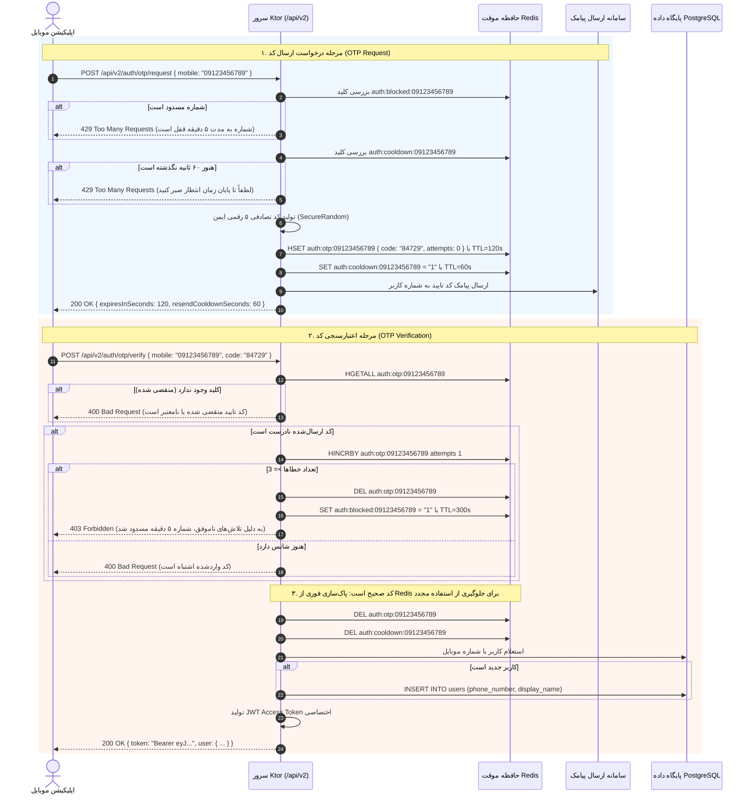
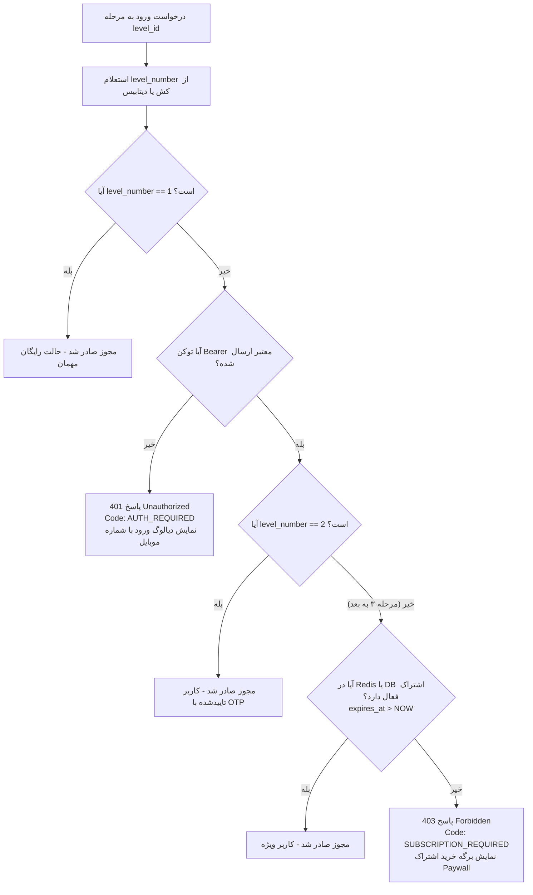

# سند جامع مشخصات فنی و معماری سرور (Technical Specification - V2)
## اپلیکیشن یادگیری مکالمه هوشمند زبان انگلیسی: AiSpeaking Plus

---

## ۱. مرور کلی و چشم‌انداز مهندسی (System Overview)

سرور **AiSpeaking Plus (نسخه ۲)** به عنوان ستون فقرات یک پلتفرم تعاملی، صوتی و بلادرنگ برای آموزش مکالمه انگلیسی مبتنی بر هوش مصنوعی توسعه داده می‌شود. این سرور با زبان **Kotlin 2.x** و بر بستر فریم‌ورک غیرمسدودکننده و بسیار سبک **Ktor 3.x (موتور Netty)** اجرا شده و بالاترین کارایی را برای ارتباطات صوتی همزمان (WebSockets)، جریان داده رویدادمحور (SSE)، پردازش‌های هوش مصنوعی و دیتابیس رابطه‌ای فراهم می‌آورد.

### ۱.۱. اهداف کلیدی معماری نسخه ۲
1. **مسیریابی کاملاً استاندارد و مدرن بر مبنای `/api/v2`:** بازطراحی کامل ساختار اندپوینت‌ها بر اساس اصول RESTful منبع‌محور (Resource-Oriented)، بدون وابستگی به نام‌گذاری‌های غیریکپارچه نسخه قبل.
2. **مکانیزم احراز هویت پیامکی امن و توزیع‌شده با Redis:** نگهداری کدهای یک‌بار مصرف (OTP) در Redis با TTL دقیق، محدودیت فرکانس درخواست (Rate-limiting Cooldown)، شمارشگر خطا جهت مقابله با حملات Brute-Force و پاک‌سازی آنی پس از مصرف.
3. **پردازش صوت محلی و مستقل از اینترنت بین‌الملل:** استفاده مستقیم از کتابخانه بومی C++ باینری **Sherpa-ONNX (Zipformer-en)** برای STT زنده و موتور **Kokoro-82M** برای سنتز صدای طبیعی تفکیک‌شده زن/مرد با حافظه نهان (Audio Cache).
4. **سیستم گیتینگ سه‌سطحی یکپارچه (Tiered Access Gate):** فیلتر خودکار و کپسوله‌شده در لایه Routing:
   $$\text{مرحله ۱ (مهمان آزاد)} \longrightarrow \text{مرحله ۲ (ورود با OTP)} \longrightarrow \text{مرحله ۳ به بعد (اشتراک ویژه / Paywall)}$$
5. **موتور ارزیابی و حفظ بالاترین رکورد (High-Score Preservation):** ثبت نمرات، خطاهای گرامری، بازخورد تشویقی فارسی و ستاره‌ها (⭐ تا ⭐⭐⭐) با تضمین ماندگاری بالاترین امتیاز در پایگاه داده PostgreSQL و کشینگ لیدربورد در Redis.

---

## ۲. پشته فناوری و لایه‌بندی معماری (Tech Stack & Clean Architecture)

### ۲.۱. پشته فناوری سرور (Technology Stack)

| مؤلفه | فناوری / کتابخانه | نسخه | نقش و مسئولیت فنی |
| :--- | :--- | :--- | :--- |
| **زبان پایه** | Kotlin JVM | `2.4.0` | کدهای همزمان با Coroutines، بدون نشت حافظه و با Type-Safety کامل |
| **هسته سرور** | Ktor Server (Netty) | `3.5.0` | مسیریابی سریع، مدیریت وب‌سوکت‌ها، استریم متنی SSE و فیلترها |
| **تزریق وابستگی** | Koin + KSP Annotations | `4.2.2` / `2.3.1` | تزریق وابستگی بدون رفلکشن در زمان کامپایل (Compile-time DI) |
| **پایگاه داده رابطه‌ای** | PostgreSQL | `15+` | ذخیره‌سازی داده‌های ساختاریافته، کاربران، مراحل، خریدها و سوابق |
| **ابزار دسترسی داده** | JetBrains Exposed (DAO & DSL) | `0.57.0` | کوئری‌نویسی امن، مدیریت تراکنش‌ها و نگاشت داده‌های دیتابیس |
| **حافظه سریع و استریم** | Redis (Redisson Client) | `7+` / `3.41.0` | انبار داده OTP، استریم پیام‌های چت، کش لیدربورد و قفل‌های همزمانی |
| **موتور تبدیل صوت (STT)** | Sherpa-ONNX Zipformer | Native / JNI | پیاده‌سازی بلادرنگ گفتار انگلیسی به متن با Endpointing پیشرفته |
| **موتور تولید گفتار (TTS)**| Sherpa-ONNX Kokoro-82M | Native / JNI | سنتز صدای طبیعی متناسب با جنسیت کاراکترهای داستانی |
| **درگاه مدل‌های زبانی** | OpenAI SDK + Google GenAI | `4.0.1` / `0.1.0` | ارتباط با مدل‌های OpenAI / AvalAI / Gemini به همراه مکانیزم Fallback |
| **احراز هویت و رمزنگاری** | Ktor JWT + BCrypt | `3.5.0` / `0.10.2` | تولید و راستی‌آزمایی توکن‌های دسترسی کاربران |
| **سریالایزر داده‌ها** | Kotlinx Serialization JSON | `1.11.0` | تبدیل داده‌های JSON با حداقل مصرف سربار CPU |

---

### ۲.۲. ساختار بسته‌بندی پاک و ماژولار (Clean Modular Structure)

پروژه به صورت Feature-Driven سازمان‌دهی می‌شود تا هر دامنه بیزنس کاملاً مستقل و قابل تست باشد:

```
src/main/kotlin/ir/speaking/
├── Application.kt                   # نقطه ورود و رجیستر کردن پلاگین‌ها
├── core/
│   ├── config/                      # مدیریت متغیرهای محیطی و تنظیمات اجرایی
│   ├── database/                    # اتصال به PostgreSQL، مایگریشن و کانکشن‌پول
│   ├── di/                          # تعاریف ماژول‌های Koin زیرساخت و شبکه
│   ├── exceptions/                  # کلاس‌های خطای سیستم و وضعیت‌های پاسخ
│   ├── middleware/                  # فیلتر AccessGate و مدیریت دسترسی رده‌ها
│   ├── network/                     # کلاینت‌های HTTP (ارسال پیامک، هوش مصنوعی، کافه‌بازار)
│   ├── redis/                       # کلاینت Redisson و توابع کار با کلیدها و استریم‌ها
│   ├── security/                    # تنظیمات JWT Token Issuer و اعتبارسنجی Claims
│   └── utils/                       # افزونه‌ها، سریالایزر تاریخ و لاگر
└── feature/
    ├── auth/                        # احراز هویت پیامکی، ذخیره OTP در ردیس و سینک مهمان
    ├── user/                        # پروفایل کاربری، استریک روزانه، تنظیمات و دستگاه‌ها
    ├── level/                       # کاتالوگ مراحل، پیش‌نمایش، هدف ماموریت و نمره‌دهی
    ├── chat/                        # استریم پاسخ‌های هوش مصنوعی (SSE) و ارزیابی زنده
    ├── stt/                         # وب‌سوکت تبدیل بلادرنگ صوت کاربر به متن
    ├── tts/                         # سرویس صوتی Kokoro با تفکیک صدای زن و مرد
    ├── subscription/                # پلن‌ها، کدهای تخفیف و اعتبارسنجی رسیدهای خرید
    ├── leaderboard/                 # رتبه‌بندی کاربران، سکوی برتر و کارت پین‌شده
    └── history/                     # سوابق بازی و تکرار مراحل با حفظ بهترین رکورد
```

---

## ۳. معماری امنیتی احراز هویت و نقش Redis در چرخه حیات OTP

یکی از مهم‌ترین وظایف لایه دسترسی، مدیریت چرخه ورود با شماره موبایل، جلوگیری از هرزنامه پیامکی، مقابله با حدس ممتد کد (Brute-Force) و تضمین مصرف یک‌باره است. این فرایند کاملاً در **Redis** مدیریت می‌شود.

### ۳.۱. مدل داده و کلیدهای Redis برای احراز هویت

```text
+---------------------------------------------------------------------------------------------------------+
| کلید در Redis (Key Pattern)           | نوع داده | طول عمر (TTL) | کاربرد و منطق بیزنس                     |
+---------------------------------------+----------+---------------+-----------------------------------------+
| auth:otp:{mobile}                     | Hash     | 120 ثانیه     | نگهداری کد ۵ رقمی و تعداد دفعات اشتباه   |
| auth:cooldown:{mobile}                | String   | 60 ثانیه      | جلوگیری از ارسال مجدد پیامک در کمتر از ۱دقیقه|
| auth:blocked:{mobile}                 | String   | 300 ثانیه     | مسدودسازی شماره در صورت ۳ بار اشتباه     |
| auth:token_blacklist:{jti}            | String   | تا پایان انقضا| ابطال توکن JWT در زمان خروج از حساب      |
+---------------------------------------------------------------------------------------------------------+
```

### ۳.۲. محتوای ساختار Hash کلید `auth:otp:{mobile}`
```json
{
  "code": "84729",
  "attempts": 0,
  "created_at": 1726081200
}
```

### ۳.۳. دیاگرام توالی فرایند OTP و نقش پایگاه داده سریع Redis



---

## ۴. ساختار مدرن مسیرها و قراردادهای API نسخه ۲ (V2 API Route Specifications)

تمام وب‌سرویس‌های سیستم با پیشوند رسمی **/api/v2** ارائه می‌شوند. طراحی مسیرها بر اساس استانداردهای مدرن RESTful و بر مبنای منابع (Resources) شکل گرفته است.

### ۴.۱. خلاصه جدول مسیریابی نسخه ۲ (API Routing Overview)

| دامنه بیزنس | متد HTTP | مسیر اندپوینت (Route) | سطح دسترسی | هدف و مسئولیت اندپوینت |
| :--- | :---: | :--- | :---: | :--- |
| **احراز هویت** | `POST` | `/api/v2/auth/otp/request` | عمومی | درخواست و تولید کد پیامکی و ذخیره در Redis |
| | `POST` | `/api/v2/auth/otp/verify` | عمومی | اعتبارسنجی کد، حذف از Redis و صدور توکن JWT |
| | `POST` | `/api/v2/auth/guest-sync` | کاربر لاگین | اتصال نتایج مرحله ۱ مهمان به حساب کاربری |
| | `POST` | `/api/v2/auth/logout` | کاربر لاگین | خروج امن و بلک‌لیست کردن توکن در Redis |
| **کاربر و پروفایل**| `GET` | `/api/v2/users/me` | کاربر لاگین | دریافت مشخصات پروفایل، استریک و روزهای اشتراک |
| | `PATCH` | `/api/v2/users/me` | کاربر لاگین | ویرایش نام، نام خانوادگی، جنسیت و آواتار |
| | `POST` | `/api/v2/users/me/device` | کاربر لاگین | ثبت و به‌روزرسانی توکن Firebase FCM |
| | `GET` | `/api/v2/users/me/history`| کاربر لاگین | فهرست جلسات بازی‌شده و بهترین ستاره‌های ثبت‌شده |
| **نقشه و مراحل** | `GET` | `/api/v2/levels` | عمومی / اختیاری| نقشه کامل مراحل با تفکیک وضعیت قفل/باز |
| | `GET` | `/api/v2/levels/{levelId}`| کنترل گیت | پیش‌نمایش، زمینه داستانی و اعلام هدف ماموریت |
| | `POST` | `/api/v2/levels/{levelId}/sessions`| کنترل گیت | آغاز نشست سناریو و دریافت پیام شروع‌کننده NPC |
| | `POST` | `/api/v2/levels/{levelId}/hints` | کنترل گیت | صدور راهنما با ثبت جریمه ستاره در نشست |
| | `POST` | `/api/v2/levels/{levelId}/complete` | کنترل گیت | ثبت و ارزیابی نهایی نمرات و ستاره‌های مرحله |
| **چت زنده و رسانه**| `WS` | `/api/v2/stt/stream` | عمومی / کاربر | اتصال وب‌سوکت استریم صدا (PCM16) به متن |
| | `POST` | `/api/v2/chat/stream` | کنترل گیت | استریم SSE پاسخ هوش مصنوعی و ارزیابی گرامر |
| | `GET` | `/api/v2/tts/voices` | عمومی | دریافت لیست صداهای تفکیک‌شده زن و مرد Kokoro |
| | `POST` | `/api/v2/tts/synthesize`| عمومی | تبدیل تک‌درخواستی متن به صدا همراه با متادیتا |
| | `GET` | `/api/v2/tts/audio/{filename}`| عمومی | استریم باینری فایل صوتی کش‌شده (WAV) |
| **اشتراک و پرداخت**| `GET` | `/api/v2/subscriptions/plans` | عمومی | دریافت پلن‌های سه‌گانه اشتراک و قیمت‌ها |
| | `POST` | `/api/v2/subscriptions/discounts/validate`| کاربر لاگین| استعلام و اعمال درصد کد تخفیف روی پلن |
| | `POST` | `/api/v2/subscriptions/purchases/bazaar` | کاربر لاگین| تایید رسید خرید درون‌برنامه‌ای کافه‌بازار |
| | `POST` | `/api/v2/subscriptions/purchases/online/request`| کاربر لاگین| شروع خرید درگاه اینترنتی مستقیم (زرین‌پال) |
| | `POST` | `/api/v2/subscriptions/purchases/online/verify` | کاربر لاگین| اعتبارسنجی نهایی پرداخت اینترنتی بانکی |
| | `GET` | `/api/v2/subscriptions/status` | کاربر لاگین| استعلام وضعیت و روزهای باقی‌مانده اشتراک فعال |
| **لیدربورد** | `GET` | `/api/v2/leaderboard` | عمومی / اختیاری| دریافت ۳ نفر اول سکو، ۴ تا ۱۰ و کارت پین‌شده کاربر |

---

### ۴.۲. مشخصات ساختار پاسخ‌ها و قراردادهای داده‌ای (DTO Contracts & Payloads)

فرمت استاندارد کلیه پاسخ‌های موفق و ناموفق سرور به صورت زیر است:

```json
{
  "status": 200,
  "success": true,
  "message": "عملیات با موفقیت انجام شد.",
  "data": { ... },
  "error": null,
  "timestamp": "2026-09-11T21:10:00Z"
}
```

---

#### ۱. احراز هویت: درخواست کد تایید (`POST /api/v2/auth/otp/request`)
* **ورودی (Payload):**
```json
{
  "mobile": "09123456789"
}
```
* **خروجی موفق (Response 200):**
```json
{
  "status": 200,
  "success": true,
  "message": "کد تایید ۵ رقمی ارسال گردید.",
  "data": {
    "mobile": "09123456789",
    "expires_in_seconds": 120,
    "resend_cooldown_seconds": 60
  },
  "error": null,
  "timestamp": "2026-09-11T21:10:00Z"
}
```

---

#### ۲. احراز هویت: تایید کد و ورود (`POST /api/v2/auth/otp/verify`)
* **ورودی (Payload):**
```json
{
  "mobile": "09123456789",
  "code": "84729"
}
```
* **خروجی موفق (Response 200):**
```json
{
  "status": 200,
  "success": true,
  "message": "ورود به حساب با موفقیت انجام شد.",
  "data": {
    "token": "eyJhbGciOiJIUzI1NiIsInR5cCI6IkpXVCJ9.eyJ1aWQiOiJjM2Q4MmE0NC03ODlmLTQzMmEtYmM5My1hNTUxOGI5NThlMGEiLCJleHAiOjE3NTc2MjUwMDB9...",
    "token_type": "Bearer",
    "expires_in": 2592000,
    "user": {
      "id": "c3d82a44-789f-432a-bc93-a5518b958e0a",
      "phone_number": "09123456789",
      "display_name": "Learner_6789",
      "first_name": null,
      "last_name": null,
      "current_level": 2,
      "total_stars": 3,
      "streak_days": 1,
      "has_active_subscription": false,
      "subscription_days_remaining": 0
    }
  },
  "error": null,
  "timestamp": "2026-09-11T21:10:05Z"
}
```

---

#### ۳. احراز هویت: همگام‌سازی مرحله ۱ مهمان (`POST /api/v2/auth/guest-sync`)
* **هدر الزامی:** `Authorization: Bearer {token}`
* **ورودی (Payload):**
```json
{
  "level_id": "11111111-1111-1111-1111-111111111111",
  "stars": 3,
  "hints_used": 0,
  "grammar_errors_count": 0
}
```
* **خروجی موفق (Response 200):**
```json
{
  "status": 200,
  "success": true,
  "message": "پیشرفت مرحله اول با حساب کاربری همگام‌سازی شد.",
  "data": {
    "current_level": 2,
    "total_stars": 3,
    "is_next_level_unlocked": true
  },
  "error": null,
  "timestamp": "2026-09-11T21:10:10Z"
}
```

---

#### ۴. پروفایل کاربر: دریافت و به‌روزرسانی (`GET` & `PATCH /api/v2/users/me`)
* **ویرایش پروفایل (PATCH Request):**
```json
{
  "first_name": "علی",
  "last_name": "تهرانی"
}
```
* **خروجی مشخصات کاربر (Response 200):**
```json
{
  "status": 200,
  "success": true,
  "message": "اطلاعات پروفایل دریافت شد.",
  "data": {
    "id": "c3d82a44-789f-432a-bc93-a5518b958e0a",
    "phone_number": "09123456789",
    "display_name": "علی تهرانی",
    "first_name": "علی",
    "last_name": "تهرانی",
    "current_level": 3,
    "total_stars": 6,
    "streak_days": 4,
    "subscription": {
      "is_active": true,
      "plan_title": "اشتراک ۳ ماهه",
      "days_remaining": 87,
      "expires_at": "2026-12-08T20:00:00Z"
    }
  },
  "error": null,
  "timestamp": "2026-09-11T21:10:15Z"
}
```

---

#### ۵. مراحل: دریافت نقشه کامل (`GET /api/v2/levels`)
* **هدر:** ارسال توکن اختیاری است (اگر ارسال شود، وضعیت پیشرفت واقعی کاربر و در غیر این صورت وضعیت مهمان لحاظ می‌شود).
* **خروجی موفق (Response 200):**
```json
{
  "status": 200,
  "success": true,
  "message": "نقشه مراحل دریافت شد.",
  "data": [
    {
      "id": "11111111-1111-1111-1111-111111111111",
      "level_number": 1,
      "title_en": "Arrival at Heathrow Airport",
      "title_fa": "ورود به فرودگاه هیترو لندن",
      "is_unlocked": true,
      "is_completed": true,
      "best_stars": 3,
      "npc": {
        "name": "Sarah",
        "gender": "FEMALE",
        "role": "Information Desk Officer"
      },
      "starter": "NPC"
    },
    {
      "id": "22222222-2222-2222-2222-222222222222",
      "level_number": 2,
      "title_en": "Local Grocery & Flat Key",
      "title_fa": "سوپرمارکت محلی و تحویل کلید آپارتمان",
      "is_unlocked": true,
      "is_completed": false,
      "best_stars": 0,
      "npc": {
        "name": "Mr. George",
        "gender": "MALE",
        "role": "Shop Owner"
      },
      "starter": "USER"
    },
    {
      "id": "33333333-3333-3333-3333-333333333333",
      "level_number": 3,
      "title_en": "Hailing a London Black Cab",
      "title_fa": "گرفتن تاکسی مشکی لندنی",
      "is_unlocked": false,
      "is_completed": false,
      "best_stars": 0,
      "npc": {
        "name": "Lewis",
        "gender": "MALE",
        "role": "Cab Driver"
      },
      "starter": "USER"
    }
  ],
  "error": null,
  "timestamp": "2026-09-11T21:10:20Z"
}
```

---

#### ۶. مراحل: شروع نشست سناریو (`POST /api/v2/levels/{levelId}/sessions`)
با فراخوانی این متد، ردیس پیام‌های قبلی این سناریو را ریست کرده و در صورتی که کاراکتر آغازگر `NPC` باشد، پیام اولیه و صدای آن فوراً تولید می‌شود:
* **خروجی موفق (Response 200):**
```json
{
  "status": 200,
  "success": true,
  "message": "نشست مرحله آماده گفت‌وگو است.",
  "data": {
    "session_id": "sess_89a1c2_lvl2",
    "starter": "NPC",
    "initial_npc_message": "Hello there! Welcome to my shop. How can I help you today?",
    "initial_npc_message_fa": "سلام! به مغازه من خوش آمدید. امروز چطور می‌توانم کمکتان کنم؟",
    "audio_url": "/api/v2/tts/audio/kokoro_lvl2_starter.wav",
    "voice_gender": "MALE"
  },
  "error": null,
  "timestamp": "2026-09-11T21:10:25Z"
}
```

---

#### ۷. مراحل: درخواست راهنما با جریمه (`POST /api/v2/levels/{levelId}/hints`)
* **ورودی (Payload):**
```json
{
  "last_npc_message": "Do you have any identification or proof of booking?"
}
```
* **خروجی موفق (Response 200):**
```json
{
  "status": 200,
  "success": true,
  "message": "راهنما با موفقیت صادر شد (یک نمره منفی ثبت گردید).",
  "data": {
    "hint_en": "You can say: 'Yes, here is the confirmation message on my phone.'",
    "hint_fa": "می‌توانید بگویید: 'بله، این پیام تاییدیه روی گوشی من است.'",
    "hints_used_so_far": 1,
    "max_stars_achievable": 2,
    "penalty_warning_fa": "استفاده از راهنما شانس کسب ۳ ستاره را از بین برد."
  },
  "error": null,
  "timestamp": "2026-09-11T21:10:30Z"
}
```

---

#### ۸. مراحل: ثبت پایان مرحله و ستاره‌ها (`POST /api/v2/levels/{levelId}/complete`)
* **ورودی (Payload):**
```json
{
  "hints_used": 1,
  "grammar_errors_count": 0,
  "duration_seconds": 135
}
```
* **خروجی موفق (Response 200):**
```json
{
  "status": 200,
  "success": true,
  "message": "مرحله با موفقیت ثبت و ذخیره شد.",
  "data": {
    "level_number": 2,
    "stars_earned": 2,
    "previous_best_stars": 0,
    "is_next_level_unlocked": true,
    "user_total_stars": 5
  },
  "error": null,
  "timestamp": "2026-09-11T21:10:35Z"
}
```

---

#### ۹. استریم گفتگوی هوش مصنوعی (`POST /api/v2/chat/stream`)
* **فرمت خروجی:** `text/event-stream` (Server-Sent Events)
* **رویدادهای جریانی:**
```text
data: {"type":"chunk","delta":"Good "}
data: {"type":"chunk","delta":"afternoon! "}
data: {"type":"chunk","delta":"Here are "}
data: {"type":"chunk","delta":"the keys to flat 4B."}
data: {"type":"done","payload":{"npc_reply_en":"Good afternoon! Here are the keys to flat 4B. Welcome to London!","is_mission_completed":true,"mission_outcome":"SUCCESS","grammar_analysis":{"has_error":false,"error_details":null,"corrected_sentence":null},"feedback_fa":"آفرین! کلید آپارتمان را با موفقیت تحویل گرفتی.","audio_url":"/api/v2/tts/audio/kokoro_f71a92.wav","voice_id":9,"voice_gender":"MALE","duration_ms":3800}}
```

---

#### ۱۰. اشتراک و خرید درون‌برنامه‌ای بازار (`POST /api/v2/subscriptions/purchases/bazaar`)
* **ورودی (Payload):**
```json
{
  "plan_id": "p2222222-0000-0000-0000-000000000002",
  "bazaar_purchase_token": "bazaar_tok_99182312a01bf78",
  "bazaar_sku": "sub_3_months_140k",
  "discount_code_id": null
}
```
* **خروجی موفق (Response 200):**
```json
{
  "status": 200,
  "success": true,
  "message": "اشتراک ویژه با موفقیت فعال شد.",
  "data": {
    "purchase_id": "pur_789123-0000-0000-0000-000000000001",
    "plan_title": "اشتراک ۳ ماهه",
    "starts_at": "2026-09-11T21:10:00Z",
    "expires_at": "2026-12-10T21:10:00Z",
    "days_remaining": 90,
    "is_active": true
  },
  "error": null,
  "timestamp": "2026-09-11T21:10:40Z"
}
```

---

#### ۱۱. لیدربورد و رتبه‌بندی برترین‌ها (`GET /api/v2/leaderboard`)
* **خروجی موفق (Response 200):**
```json
{
  "status": 200,
  "success": true,
  "message": "جدول رتبه‌بندی با موفقیت دریافت شد.",
  "data": {
    "top_three_podium": [
      {
        "rank": 1,
        "user_id": "u1111111-0000-0000-0000-000000000001",
        "display_name": "رضا رحیمی",
        "current_level": 14,
        "total_stars": 42
      },
      {
        "rank": 2,
        "user_id": "u2222222-0000-0000-0000-000000000002",
        "display_name": "سارا احمدی",
        "current_level": 13,
        "total_stars": 39
      },
      {
        "rank": 3,
        "user_id": "u3333333-0000-0000-0000-000000000003",
        "display_name": "Learner_9901",
        "current_level": 12,
        "total_stars": 34
      }
    ],
    "ranks_four_to_ten": [
      {
        "rank": 4,
        "user_id": "u4444444-0000-0000-0000-000000000004",
        "display_name": "Mohammad V.",
        "current_level": 11,
        "total_stars": 31
      }
    ],
    "current_user_summary": {
      "rank": 42,
      "user_id": "c3d82a44-789f-432a-bc93-a5518b958e0a",
      "display_name": "Learner_6789",
      "current_level": 3,
      "total_stars": 5,
      "is_in_top_ten": false
    }
  },
  "error": null,
  "timestamp": "2026-09-11T21:10:45Z"
}
```

---

## ۵. پروتکل‌های صوتی و وب‌سوکت تبدیل گفتار به متن (Voice & Media Pipelines)

### ۵.۱. وب‌سوکت استریم گفتار به متن (`WS /api/v2/stt/stream`)

* **قالب ارتباطی:** `ws://` یا `wss://`
* **ورودی صدا:** فریم‌های باینری (`Frame.Binary`) از نوع **PCM 16-bit Signed Little-Endian (mono)** با نرخ نمونه‌برداری **16,000 Hz**.
* **مکانیزم قطع فوری صدای هوش مصنوعی (Barge-in):** با لمس دکمه میکروفون در کلاینت، پخش صدای کاراکتر قطع شده و سرور بافر ورودی جدید را بلافاصله بدون تاخیر تحویل موتور `OnlineRecognizer` در Sherpa-ONNX می‌دهد.
* **پروتکل پیام‌های سرور (Server Text Frames):**
  1. `{"type": "ready", "message": "Stream ready."}`
  2. `{"type": "partial", "text": "I want to pick up"}` (متن زنده نیمه‌نهایی)
  3. `{"type": "final", "text": "I want to pick up my apartment key."}` (متن قطعی پس از تشخیص سکوت ۱.۴ ثانیه‌ای)
  4. `{"type": "error", "code": "SERVER_BUSY", "message": "Capacity reached."}` (در صورت پر بودن صف بافر)

### ۵.۲. سرویس صوتی تفکیک جنسیت کاراکتر (Gender-Based Kokoro-82M TTS)

1. **جدول پروفایل‌های صوتی منتخب:**
   * **کاراکترهای زن:**
     * شناسه `1` (`af_bella`): لهجه شفاف آمریکایی، شخصیت‌های شاد و صمیمی.
     * شناسه `7` (`bf_emma`): لهجه بریتانیایی شیک، مناسب هتل، فرودگاه و محیط لندن.
   * **کاراکترهای مرد:**
     * شناسه `6` (`am_michael`): لهجه عمیق و دوستانه آمریکایی.
     * شناسه `9` (`bm_george`): لهجه اصیل بریتانیایی، شخصیت مغازه‌دار و راننده تاکسی لندن.
2. **کشینگ MD5 روی دیسک:** هر دیالوگ با ترکیب هش `MD5(text + voiceId + speed)` با فرمت استاندارد WAV کش می‌شود تا درخواست‌های بعدی یا بازپخش‌ها با تاخیر ۰ میلی‌ثانیه مستقیماً از مسیر `/api/v2/tts/audio/{filename}` بارگذاری شوند.

---

## ۶. پیاده‌سازی فیلتر کنترل دسترسی سه‌سطحی (Tiered AccessGatePlugin)

در Ktor نسخه ۳، یک پلاگین سفارشی به نام `AccessGatePlugin` روی روت‌های `/api/v2/levels/**` نصب می‌شود:



---

## ۷. استراتژی استقرار و تضمین پایداری (Deployment & Infrastructure)

1. **داکرایز استاندارد با JDK 21 و Netty:**
   * استفاده از فایل‌های داکر موجود و هماهنگی کامل متغیرهای محیطی با Redis و PostgreSQL.
2. **مدیریت نشت حافظه Sherpa-ONNX:**
   * تضمین فراخوانی `stream.release()` در بلاک‌های `finally` کوروتین‌های Ktor جهت جلوگیری از سرریز حافظه Native C++.
3. **پیکربندی Nginx برای نسخه ۲:**
   * هدایت ترافیک مسیر `/api/v2/stt/stream` با تنظیمات اختصاصی WebSocket Upgrade و تایم‌اوت طولانی.
   * فعال‌سازی فشرده‌سازی `gzip` برای تمامی پاسخ‌های ساختاریافته JSON نسخه ۲.
