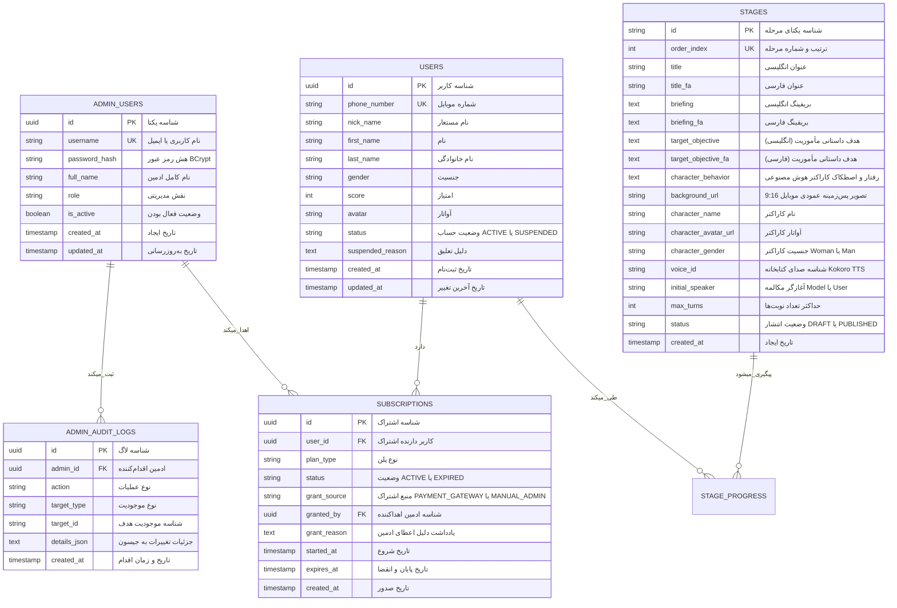

# مدل داده و پایگاه‌داده: پنل ادمین تحت وب (Data Model)

**شاخه فیچر**: `002-web-admin-panel`  
**تاریخ**: ۱۴۰۵/۰۷/۰۶ (2026-09-27)  
**وضعیت**: نهایی‌شده (Completed)  

---

## ۱. نمودار روابط موجودیت‌ها (ER Diagram)

---

## ۲. مشخصات جداول پایگاه‌داده (Database Tables)

### ۲.۱. جدول مدیران (`admin_users`) - جدول جدید

| نام فیلد | نوع داده | محدودیت‌ها | توضیحات |
| :--- | :--- | :--- | :--- |
| `id` | `UUID` | Primary Key, مقدار پیش‌فرض تصادفی | شناسه اختصاصی مدیر |
| `username` | `VARCHAR(128)` | Unique, Not Null | ایمیل یا نام کاربری ورود به پنل |
| `password_hash` | `VARCHAR(255)` | Not Null | رمز عبور هش‌شده با الگوریتم BCrypt |
| `full_name` | `VARCHAR(128)` | Not Null | نام و نام‌خانوادگی مدیر |
| `role` | `VARCHAR(32)` | Not Null, پیش‌فرض: `'ROLE_ADMIN'` | نقش (`ROLE_SUPER_ADMIN` یا `ROLE_ADMIN`) |
| `is_active` | `BOOLEAN` | Not Null, پیش‌فرض: `true` | وضعیت فعال بودن حساب مدیر |
| `created_at` | `TIMESTAMP` | پیش‌فرض: `CurrentTimestamp` | زمان ایجاد حساب |
| `updated_at` | `TIMESTAMP` | پیش‌فرض: `CurrentTimestamp` | زمان آخرین تغییر |

### ۲.۲. جدول لاگ تغییرات و تاریخچه (`admin_audit_logs`) - جدول جدید

| نام فیلد | نوع داده | محدودیت‌ها | توضیحات |
| :--- | :--- | :--- | :--- |
| `id` | `UUID` | Primary Key | شناسه رکورد لاگ |
| `admin_id` | `UUID` | Foreign Key به `admin_users.id`, Indexed | مدیری که این اقدام را انجام داده |
| `action` | `VARCHAR(64)` | Not Null, Indexed | نوع عملیات (`STAGE_UPSERT`, `USER_SUSPEND`, `SUBSCRIPTION_GRANT_MANUAL`) |
| `target_type` | `VARCHAR(32)` | Not Null | نوع هدف (`STAGE`, `USER`, `SUBSCRIPTION`) |
| `target_id` | `VARCHAR(64)` | Not Null | شناسه موجودیت هدف |
| `details_json` | `TEXT` | Not Null | خلاصه اطلاعات تغییریافته به فرمت JSON |
| `created_at` | `TIMESTAMP` | پیش‌فرض: `CurrentTimestamp`, Indexed | زمان دقیق ثبت اقدام |

### ۲.۳. تغییرات جدول کاربران (`users`)

| نام فیلد جدید | نوع داده | محدودیت‌ها | توضیحات |
| :--- | :--- | :--- | :--- |
| `status` | `VARCHAR(32)` | Not Null, پیش‌فرض: `'ACTIVE'`, Indexed | وضعیت حساب (`ACTIVE` یا `SUSPENDED`) |
| `suspended_reason` | `TEXT` | Nullable | توضیحات اختیاری ادمین در صورت تعلیق حساب |

### ۲.۴. تغییرات جدول اشتراک‌ها (`subscriptions`)

| نام فیلد جدید | نوع داده | محدودیت‌ها | توضیحات |
| :--- | :--- | :--- | :--- |
| `grant_source` | `VARCHAR(32)` | Not Null, پیش‌فرض: `'PAYMENT_GATEWAY'`, Indexed | منبع (`PAYMENT_GATEWAY`, `MANUAL_ADMIN`, `GIFT`) |
| `granted_by` | `UUID` | Nullable, Foreign Key به `admin_users.id` | شناسه ادمینی که اشتراک را دستی اضافه کرده |
| `grant_reason` | `TEXT` | Nullable | علت اهدای اشتراک (مثلاً حل مشکل پشتیبانی، مسابقه و ...) |

### ۲.۵. تغییرات جدول مراحل (`stages`)

| نام فیلد جدید | نوع داده | محدودیت‌ها | توضیحات |
| :--- | :--- | :--- | :--- |
| `status` | `VARCHAR(32)` | Not Null, پیش‌فرض: `'PUBLISHED'`, Indexed | وضعیت (`DRAFT` برای در حال ساخت، `PUBLISHED` برای فعال) |
| `target_objective_fa` | `TEXT` | Not Null | هدف داستانی و چالش مأموریت به زبان فارسی (جهت نمایش به کاربر) |
| `character_behavior` | `TEXT` | Nullable | پرامپت رفتار کاراکتر هوش مصنوعی (لحن، اصطکاک، راستی‌آزمایی و شروط مقاومت) |

> **نکته ابعاد تصاویر (`background_url`)**: تصاویر پس‌زمینه سناریوها در آپلود پنل ادمین باید دارای جهت **عمودی (Vertical Portrait نسبت ۹:۱۶ مناسب نمایش تمام‌صفحه در تلفن همراه)** باشند و تصاویر افقی لنداسکیپ منسوخ هستند.

---

## ۳. قواعد اعتبارسنجی داده‌ها

1. **نرمال‌سازی ارقام شماره موبایل**: در کلیه جستجوهای پنل، ارقام فارسی (`۰-۹`) به ارقام انگلیسی تبدیل شده و کدهای بین‌المللی (`+98` و `0098`) به صورت خودکار به ساختار استاندارد ۱۱ رقمی `09XXXXXXXXX` نرمال می‌شوند.
2. **انباشت زمان اشتراک**: اگر کاربری اشتراک فعال داشته باشد (`expires_at > now()`)، ثبت اشتراک دستی جدید تاریخ انقضای موجود را پاک نمی‌کند؛ بلکه زمان جدید به انتهای مهلت قبلی اضافه می‌گردد.
3. **تغییرناپذیری تاریخچه عملیات**: رکوردهای جدول `admin_audit_logs` فقط خواندنی (Append-Only) هستند و امکان ویرایش یا حذف آن‌ها وجود ندارد.
