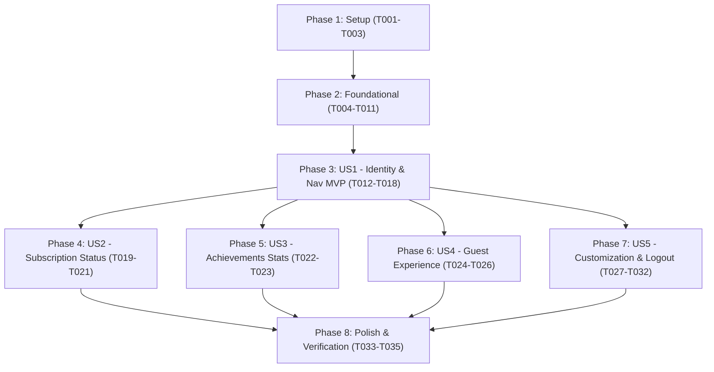

# Tasks: User Profile & Account Overview

**Feature**: `003-user-profile`  
**Input**: Design artifacts from `specs/003-user-profile/` (`spec.md`, `plan.md`, `data-model.md`, `contracts/user-profile-api.md`, `research.md`, `quickstart.md`)  
**Status**: Ready for Implementation  

---

## Phase 1: Setup (Shared Infrastructure)

**Purpose**: Shared DTO models and localized resources for the profile feature.

- [X] T001 Create client network DTO models in `network/src/commonMain/kotlin/ir/aispeaking/network/model/user/dto/UserProfileDtos.kt` (`UserProfileResponseDto`, `SubscriptionSummaryDto`, `UpdateProfileRequestDto`)
- [X] T002 [P] Create server DTO models matching API contract in `server/src/main/kotlin/ir/speaking/feature/user/dto/UserProfileDtos.kt` (`UserProfileResponseDto`, `SubscriptionSummaryDto`, `UpdateProfileRequestDto`)
- [X] T003 [P] Add Persian string resources for profile, subscription, achievements, guest banner, and sign out in `sharedUI/src/commonMain/composeResources/values/strings.xml`

---

## Phase 2: Foundational (Blocking Prerequisites)

**Purpose**: Core domain contracts, data mappers, server queries, and DI wiring that MUST be complete before user story UI implementation.

**⚠️ CRITICAL**: No user story UI work can begin until this phase is complete.

- [X] T004 Define domain models in `domain/src/commonMain/kotlin/ir/aispeaking/domain/model/user/UserProfile.kt` (`UserProfile`, `SubscriptionSummary`, `UpdateProfileInput`)
- [X] T005 [P] Define repository interface in `domain/src/commonMain/kotlin/ir/aispeaking/domain/repository/user/UserProfileRepository.kt` (`getUserProfile()`, `updateProfile(input: UpdateProfileInput)`, `getGuestProfile()`)
- [X] T006 [P] Implement `UserApi` interface and HTTP client calls in `network/src/commonMain/kotlin/ir/aispeaking/network/api/user/UserApi.kt` (`getProfile()`, `updateProfile()`)
- [X] T007 Implement bidirectional mappers between DTOs, storage, and domain in `data/src/commonMain/kotlin/ir/aispeaking/data/mapper/user/UserProfileMappers.kt`
- [X] T008 Implement aggregated profile database queries in `server/src/main/kotlin/ir/speaking/feature/user/repository/UserRepo.kt` joining `UserTable`, `SubscriptionTable` (active status, expiresAt, remainingDays), and `StageProgressTable` (totalStars, completedStagesCount)
- [X] T009 Implement `userRouting` in `server/src/main/kotlin/ir/speaking/feature/user/routing/UserRouting.kt` exposing authenticated `GET /api/v2/user/profile` and `PUT /api/v2/user/profile` with OpenAPI 3.0.3 `.describe { ... }` metadata and register in `server/src/main/kotlin/ir/speaking/Application.kt`
- [X] T010 Implement `UserProfileRepositoryImpl` in `data/src/commonMain/kotlin/ir/aispeaking/data/repository/user/UserProfileRepositoryImpl.kt` integrating `UserApi`, `UserPreferences`, and `LocalGuestProgressDataSource`
- [X] T011 Register `UserApi`, `UserProfileRepository`, and use cases in Koin modules: `network/src/commonMain/kotlin/ir/aispeaking/network/di/NetworkKoinModule.kt`, `data/src/commonMain/kotlin/ir/aispeaking/data/di/DataKoinModule.kt`, and `domain/src/commonMain/kotlin/ir/aispeaking/domain/di/DomainKoinModule.kt`

**Checkpoint**: Foundation ready - User Story implementation can begin.

---

## Phase 3: User Story 1 - Navigate to Profile & View Core Identity (Priority: P1) 🎯 MVP

**Goal**: As a learner, I can tap a profile button in the top bar of the Journey Map, navigate to the dedicated Profile screen, and view my avatar, display name, and registered phone number.

**Independent Test**: Launch the app, verify the profile button appears in the Journey Map header, tap it, verify navigation to Profile screen in under 1 second, and verify displayed avatar, nickname, and phone number match the server profile. Tap back button to return to Journey Map.

- [X] T012 [P] [US1] Implement `GetUserProfileUseCase` in `domain/src/commonMain/kotlin/ir/aispeaking/domain/usecase/user/GetUserProfileUseCase.kt`
- [X] T013 [US1] Add `ProfileRoute : AppRoute` with `screenName = "Profile"` in `navigation/src/commonMain/kotlin/ir/aispeaking/navigation/Routes.kt`
- [X] T014 [US1] Implement `ProfileUiState` and `ProfileViewModel` in `sharedUI/src/commonMain/kotlin/ir/aispeaking/sharedui/ui/profile/ProfileViewModel.kt` handling loading, success, and error states
- [X] T015 [P] [US1] Build `ProfileHeaderCard` composable in `sharedUI/src/commonMain/kotlin/ir/aispeaking/sharedui/ui/profile/component/ProfileHeaderCard.kt` displaying avatar image, nickname, and phone number with RTL layout
- [X] T016 [US1] Build base `ProfileScreen` layout in `sharedUI/src/commonMain/kotlin/ir/aispeaking/sharedui/ui/profile/ProfileScreen.kt` with top bar, back button, error snackbar, and `ProfileHeaderCard`
- [X] T017 [US1] Register `entry<ProfileRoute>` destination in `navigation/src/commonMain/kotlin/ir/aispeaking/navigation/AppNavigation.kt` with back navigation handler
- [X] T018 [US1] Add clickable Profile icon button (`Res.drawable.ic_profile`) in top header of `sharedUI/src/commonMain/kotlin/ir/aispeaking/sharedui/ui/stage/JourneyMapScreen.kt` triggering `onNavigateToProfile()`

**Checkpoint**: User Story 1 (MVP) is fully functional and testable independently.

---

## Phase 4: User Story 2 - Subscription Status & Remaining Days Transparency (Priority: P1)

**Goal**: As a learner, I can clearly see whether I have an active subscription, my active plan title, expiration date, and the exact count of remaining active days, or a prompt to purchase premium access.

**Independent Test**: Log in with both subscribed and free accounts; verify the card shows active badge, plan title, expiration date, and countdown of remaining days for subscribers, and "پلن رایگان" with upgrade button for free accounts.

- [X] T019 [P] [US2] Build `SubscriptionCard` composable in `sharedUI/src/commonMain/kotlin/ir/aispeaking/sharedui/ui/profile/component/SubscriptionCard.kt` supporting Active Subscriber (crown icon, plan title, expiration date, remaining days countdown) and Free tier with Upgrade action
- [X] T020 [US2] Integrate `SubscriptionCard` into `sharedUI/src/commonMain/kotlin/ir/aispeaking/sharedui/ui/profile/ProfileScreen.kt` and wire upgrade CTA callback to paywall / plans navigation
- [X] T021 [US2] Add renewal highlight warning in `SubscriptionCard` in `sharedUI/src/commonMain/kotlin/ir/aispeaking/sharedui/ui/profile/component/SubscriptionCard.kt` when `isExpiringSoon` is true (remaining days <= 7)

**Checkpoint**: User Stories 1 AND 2 work together independently.

---

## Phase 5: User Story 3 - Learning Progress & Achievements Statistics (Priority: P2)

**Goal**: As a learner, I can view my total stars earned (⭐), learning score/XP, completed story stages count, and English proficiency level badge on the profile page.

**Independent Test**: Complete conversation stages to earn stars, navigate to Profile, and verify the total stars counter, score XP, completed stages count, and CEFR level badge match real progress.

- [X] T022 [P] [US3] Build `AchievementStatsCard` composable in `sharedUI/src/commonMain/kotlin/ir/aispeaking/sharedui/ui/profile/component/AchievementStatsCard.kt` displaying a 4-item grid (Total Stars with `ic_star`, Total Points with `ic_points`, Completed Stages count, Language Level badge)
- [X] T023 [US3] Integrate `AchievementStatsCard` into `sharedUI/src/commonMain/kotlin/ir/aispeaking/sharedui/ui/profile/ProfileScreen.kt` with live data binding from `ProfileUiState`

**Checkpoint**: User Stories 1, 2, and 3 are functional.

---

## Phase 6: User Story 4 - Guest User Profile Experience & Conversion (Priority: P2)

**Goal**: Unregistered guest users can access the profile to view their local stars and score, accompanied by an informative conversion banner to log in / register and preserve progress.

**Independent Test**: Launch the app without logging in, open the Profile screen, verify "زبان‌آموز مهمان" and local stars are shown with the registration incentive banner. Tap "ورود / ثبت‌نام" to open login flow, authenticate, and verify local stars merge into the registered account.

- [X] T024 [US4] Implement guest fallback logic in `UserProfileRepositoryImpl` in `data/src/commonMain/kotlin/ir/aispeaking/data/repository/user/UserProfileRepositoryImpl.kt` querying `LocalGuestProgressDataSource` and `UserPreferences` when unauthenticated
- [X] T025 [P] [US4] Build `GuestBannerCard` composable in `sharedUI/src/commonMain/kotlin/ir/aispeaking/sharedui/ui/profile/component/GuestBannerCard.kt` presenting a motivational message and "ورود / ثبت‌نام" action button
- [X] T026 [US4] Integrate `GuestBannerCard` into `sharedUI/src/commonMain/kotlin/ir/aispeaking/sharedui/ui/profile/ProfileScreen.kt` shown conditionally when `uiState.user.isGuest == true` and navigating to `LoginRoute`

**Checkpoint**: Guest experience and conversion funnel work without data loss.

---

## Phase 7: User Story 5 - Profile Customization & Session Management (Priority: P3)

**Goal**: Authenticated users can edit their nickname (constrained to: "2..50 characters, trimmed"), pick a new avatar from available presets, and safely sign out of their account via a confirmation dialog.

**Independent Test**: Tap edit profile, update nickname, pick new avatar `avatar_g5`, tap save, verify updated data reflects immediately. Tap "خروج از حساب", confirm in the dialog, verify credentials are wiped and app redirects to entry flow.

- [X] T027 [P] [US5] Implement `UpdateUserProfileUseCase` in `domain/src/commonMain/kotlin/ir/aispeaking/domain/usecase/user/UpdateUserProfileUseCase.kt` validating constraints: `nickName` must be 2..50 characters trimmed
- [X] T028 [P] [US5] Build `AvatarPickerDialog` composable in `sharedUI/src/commonMain/kotlin/ir/aispeaking/sharedui/ui/profile/component/AvatarPickerDialog.kt` displaying a grid of available preset avatar drawables (`avatar_g1` to `avatar_g12`, `avatar_b8`, `avatar_b9`)
- [X] T029 [P] [US5] Build `SignOutConfirmDialog` composable in `sharedUI/src/commonMain/kotlin/ir/aispeaking/sharedui/ui/profile/component/SignOutConfirmDialog.kt` prompting confirmation before terminating the session
- [X] T030 [US5] Add edit nickname modal dialog and avatar picker trigger in `ProfileHeaderCard` in `sharedUI/src/commonMain/kotlin/ir/aispeaking/sharedui/ui/profile/component/ProfileHeaderCard.kt`
- [X] T031 [US5] Implement `onUpdateProfile` and `onSignOut` handlers in `ProfileViewModel` in `sharedUI/src/commonMain/kotlin/ir/aispeaking/sharedui/ui/profile/ProfileViewModel.kt` utilizing `UpdateUserProfileUseCase` and `AuthRepository.logout()`
- [X] T032 [US5] Wire edit profile dialog, avatar picker, and sign-out confirmation in `sharedUI/src/commonMain/kotlin/ir/aispeaking/sharedui/ui/profile/ProfileScreen.kt`

**Checkpoint**: All 5 user stories are completely functional.

---

## Phase 8: Polish & Cross-Cutting Concerns

**Purpose**: Lifecycle responsiveness, typography, RTL verification, and validation scenarios.

- [X] T033 [P] Add pull-to-refresh and onResume automatic refresh in `ProfileScreen` in `sharedUI/src/commonMain/kotlin/ir/aispeaking/sharedui/ui/profile/ProfileScreen.kt`
- [X] T034 [P] Audit all Persian strings, Persian digits, and RTL alignment across profile cards in `sharedUI/src/commonMain/kotlin/ir/aispeaking/sharedui/ui/profile/` per `persian-writing` standard
- [X] T035 Execute end-to-end verification scenarios from `specs/003-user-profile/quickstart.md`

---

## Dependencies & Execution Order

### User Story Dependencies
- **User Story 1 (P1)**: Depends only on Foundational (Phase 2). No dependency on other user stories. This is the **MVP**.
- **User Story 2 (P1)**: Plugs into `ProfileScreen` created in US1. Can be tested independently.
- **User Story 3 (P2)**: Plugs into `ProfileScreen` created in US1. Can be tested independently.
- **User Story 4 (P2)**: Plugs into `ProfileScreen` created in US1. Can be tested independently.
- **User Story 5 (P3)**: Plugs into `ProfileScreen` and `ProfileHeaderCard` created in US1. Can be tested independently.

---

## Parallel Opportunities

- **Phase 1 (Setup)**: T002 and T003 can run in parallel with T001.
- **Phase 2 (Foundational)**:
  - T005 (`UserProfileRepository`) and T006 (`UserApi`) can be created in parallel once T004 is defined.
  - T008 (Server database queries) and T007 (Client mappers) can be built in parallel.
- **Phase 3 (US1)**: T012 (`GetUserProfileUseCase`) and T015 (`ProfileHeaderCard`) can be built in parallel.
- **Phases 4, 5, 6, 7**: Once Phase 3 (MVP) is in place, US2 (`SubscriptionCard`), US3 (`AchievementStatsCard`), US4 (`GuestBannerCard`), and US5 dialogs can each be implemented in parallel across separate component files.

---

## Implementation Strategy

### MVP First (User Story 1 Only)
1. Complete Phase 1 (Setup) and Phase 2 (Foundational).
2. Complete Phase 3 (User Story 1).
3. **Validate**: Open app, tap profile button on Journey Map, verify navigation to Profile screen and observe user avatar, nickname, and phone number loaded from server.
4. Deliver working MVP increment!

### Incremental Feature Additions
1. Add Phase 4 (US2: Subscription Status & Remaining Days).
2. Add Phase 5 (US3: Achievement Stats Grid - Stars, XP, Level).
3. Add Phase 6 (US4: Guest Experience & Conversion Banner).
4. Add Phase 7 (US5: Profile Editing & Safe Sign Out).
5. Add Phase 8 (Polish & Verification).
