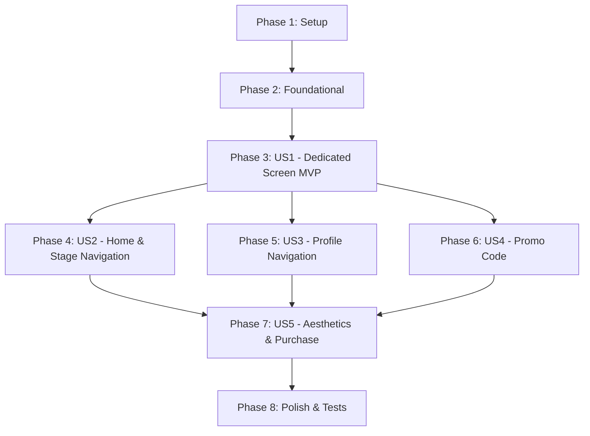

# Tasks: صفحه اختصاصی اشتراک‌ها و ارتقای حساب کاربری ویژه

**Feature**: `004-subscription-screen`  
**Input**: Design artifacts from `specs/004-subscription-screen/` (`spec.md`, `plan.md`, `data-model.md`, `contracts/subscription-api.md`, `research.md`, `quickstart.md`)  
**Status**: Ready for Implementation  

---

## Phase 1: Setup (Shared Infrastructure)

**Purpose**: Shared resources, color tokens, and network DTO models for the subscription feature.

- [X] T001 Add Persian string resources and color tokens for subscription screen in `sharedUI/src/commonMain/composeResources/values/strings.xml` and `sharedUI/src/commonMain/kotlin/ir/aispeaking/sharedui/ui/them/Color.kt`
- [X] T002 Create client DTO models `SubscribeRequestDto` and `SubscribeResponseDto` in `network/src/commonMain/kotlin/ir/aispeaking/network/model/stage/dto/StageDtos.kt`
- [X] T003 [P] Create server DTO models `SubscribeRequestDto` and `SubscribeResponseDto` in `server/src/main/kotlin/ir/speaking/feature/subscription/routing/subscriptionRouting.kt`

---

## Phase 2: Foundational (Blocking Prerequisites)

**Purpose**: Domain repository contracts, use cases, client network calls, server subscribe endpoint, and DI wiring that MUST be complete before user story UI implementation.

**⚠️ CRITICAL**: No user story UI work can begin until this phase is complete.

- [X] T004 Define `subscribe(planId: String, promoCode: String?): DataResult<SubscriptionStatus>` in `domain/src/commonMain/kotlin/ir/aispeaking/domain/repository/stage/SubscriptionRepository.kt`
- [X] T005 [P] Implement `SubscribePlanUseCase` in `domain/src/commonMain/kotlin/ir/aispeaking/domain/usecase/stage/SubscriptionUseCases.kt`
- [X] T006 [P] Add `subscribe(request: SubscribeRequestDto): NetworkResponse<SubscribeResponseDto>` call in `network/src/commonMain/kotlin/ir/aispeaking/network/api/stage/SubscriptionApi.kt`
- [X] T007 Implement `subscribe` in `data/src/commonMain/kotlin/ir/aispeaking/data/repository/stage/SubscriptionRepositoryImpl.kt` invoking `SubscriptionApi.subscribe`
- [X] T008 Implement `POST /api/v2/subscriptions/subscribe` route with OpenAPI 3.0.3 `.describe { ... }` metadata in `server/src/main/kotlin/ir/speaking/feature/subscription/routing/subscriptionRouting.kt` and add `activateSubscription` in `server/src/main/kotlin/ir/speaking/feature/subscription/repository/SubscriptionRepo.kt`
- [X] T009 Register `SubscribePlanUseCase` in Koin DI module in `domain/src/commonMain/kotlin/ir/aispeaking/domain/di/DomainKoinModule.kt`

**Checkpoint**: Foundation ready - User Story implementation can begin.

---

## Phase 3: User Story 1 - Dedicated Subscription Screen & Plan Selection (Priority: P1) 🎯 MVP

**Goal**: As a learner, I can view available subscription plans (1 month, 3 months, 6 months) on a dedicated fullscreen page, see prices and badges, select my preferred plan, and navigate back smoothly.

**Independent Test**: Launch the app, navigate to `SubscriptionRoute`, verify all 3 plans render with titles, prices, duration days, and badges. Tap each plan to verify selection highlight updates. Tap the back button to verify smooth return to previous screen.

- [X] T010 [US1] Define `SubscriptionRoute : AppRoute` with `screenName = "Subscription"` in `navigation/src/commonMain/kotlin/ir/aispeaking/navigation/Routes.kt` and register serializer in `navigation/src/commonMain/kotlin/ir/aispeaking/navigation/config.kt`
- [X] T011 [P] [US1] Create MVI contract `SubscriptionState`, `SubscriptionIntent`, `SubscriptionEffect` in `sharedUI/src/commonMain/kotlin/ir/aispeaking/sharedui/ui/subscription/SubscriptionContract.kt`
- [X] T012 [US1] Implement `SubscriptionViewModel` in `sharedUI/src/commonMain/kotlin/ir/aispeaking/sharedui/ui/subscription/SubscriptionViewModel.kt` handling `GetSubscriptionPlansUseCase`, `CheckSubscriptionStatusUseCase`, and plan selection state
- [X] T013 [P] [US1] Build `PlanSelectionCard` composable in `sharedUI/src/commonMain/kotlin/ir/aispeaking/sharedui/ui/subscription/component/PlanSelectionCard.kt` displaying title, duration, total price in Tomans, discount percentage, badges ("محبوب‌ترین", "بهترین ارزش"), and daily price breakdown with active selection border
- [X] T014 [US1] Build base `SubscriptionScreen` composable in `sharedUI/src/commonMain/kotlin/ir/aispeaking/sharedui/ui/subscription/SubscriptionScreen.kt` with RTL layout, top app bar with back button, scrollable plans list, and purchase button
- [X] T015 [US1] Register `entry<SubscriptionRoute>` in `navigation/src/commonMain/kotlin/ir/aispeaking/navigation/AppNavigation.kt` with back navigation handler

**Checkpoint**: User Story 1 (MVP) is fully functional and testable independently.

---

## Phase 4: User Story 2 - Seamless Navigation from Home & Locked Stages (Priority: P1)

**Goal**: As a learner, tapping "خرید اشتراک" in the Journey Map header or tapping a locked conversation stage (Stage 3+) directly navigates to the dedicated Subscription screen instead of a bottom sheet dialog.

**Independent Test**: Open Journey Map screen, tap the header "خرید اشتراک" button and verify it opens `SubscriptionScreen`. Return and tap Stage 3 (locked stage); verify it also opens `SubscriptionScreen` instead of `SubscriptionPaywallSheet`.

- [X] T016 [US2] Add `onNavigateToSubscription: () -> Unit` parameter to `JourneyMapScreen` in `sharedUI/src/commonMain/kotlin/ir/aispeaking/sharedui/ui/stage/JourneyMapScreen.kt`
- [X] T017 [US2] Update top bar "خرید اشتراک" button in `sharedUI/src/commonMain/kotlin/ir/aispeaking/sharedui/ui/stage/JourneyMapScreen.kt` to trigger `onNavigateToSubscription()`
- [X] T018 [US2] Update stage click interaction in `sharedUI/src/commonMain/kotlin/ir/aispeaking/sharedui/ui/stage/JourneyMapScreen.kt` and `sharedUI/src/commonMain/kotlin/ir/aispeaking/sharedui/ui/stage/JourneyMapViewModel.kt` so clicking stages with `StageLockStatus.LOCKED_SUBSCRIPTION` invokes `onNavigateToSubscription()`
- [X] T019 [US2] Remove `SubscriptionPaywallSheet` invocation and dead code from `sharedUI/src/commonMain/kotlin/ir/aispeaking/sharedui/ui/stage/JourneyMapScreen.kt`
- [X] T020 [US2] Wire `onNavigateToSubscription = { backStack.add(SubscriptionRoute) }` in `entry<MainRoute>` in `navigation/src/commonMain/kotlin/ir/aispeaking/navigation/AppNavigation.kt`

**Checkpoint**: User Stories 1 AND 2 work together seamlessly.

---

## Phase 5: User Story 3 - Navigation & Renewal from Profile Screen (Priority: P1)

**Goal**: As a learner, tapping upgrade or renew in my Profile subscription card navigates directly to the Subscription screen with current subscription status and extension options.

**Independent Test**: Navigate to Profile screen, tap "خرید اشتراک" or "تمدید اشتراک" on `SubscriptionCard`, verify `SubscriptionScreen` opens. If user already has active days, verify remaining days count is displayed with an extension banner.

- [X] T021 [US3] Wire `onNavigateToSubscription = { backStack.add(SubscriptionRoute) }` in `entry<ProfileRoute>` in `navigation/src/commonMain/kotlin/ir/aispeaking/navigation/AppNavigation.kt` (replacing empty lambda `{}`)
- [X] T022 [US3] Ensure `SubscriptionCard` in `sharedUI/src/commonMain/kotlin/ir/aispeaking/sharedui/ui/profile/component/SubscriptionCard.kt` triggers `onUpgradeClick` callback for both free tier and active expiring tier
- [X] T023 [US3] Display current active subscription banner and remaining days extension notice in `sharedUI/src/commonMain/kotlin/ir/aispeaking/sharedui/ui/subscription/SubscriptionScreen.kt` when `currentStatus.isSubscriber` is true

**Checkpoint**: User Stories 1, 2, and 3 work together independently.

---

## Phase 6: User Story 4 - Promo Code Validation & Dynamic Pricing (Priority: P2)

**Goal**: As a buyer, I can enter a discount promo code, receive immediate validation feedback, and see the final discounted price updated on plan cards and the purchase button.

**Independent Test**: On `SubscriptionScreen`, enter a valid promo code and tap "اعمال"; verify green success message and discounted prices. Enter an invalid code; verify error message and base prices remain.

- [X] T024 [P] [US4] Build `PromoCodeInputRow` composable in `sharedUI/src/commonMain/kotlin/ir/aispeaking/sharedui/ui/subscription/component/PromoCodeInputRow.kt` with text input, Apply button, and status/error feedback message
- [X] T025 [US4] Implement promo code validation and discount calculation logic in `sharedUI/src/commonMain/kotlin/ir/aispeaking/sharedui/ui/subscription/SubscriptionViewModel.kt` updating `appliedPromo` and effective prices
- [X] T026 [US4] Integrate `PromoCodeInputRow` into `sharedUI/src/commonMain/kotlin/ir/aispeaking/sharedui/ui/subscription/SubscriptionScreen.kt` with reactive state binding to `SubscriptionViewModel`

**Checkpoint**: User Story 4 works with instant discount feedback.

---

## Phase 7: User Story 5 - Vibrant Aesthetics, Benefits List & Live Purchase Activation (Priority: P2)

**Goal**: As a learner, I experience a visually captivating, colorful screen with a glowing crown hero header, feature comparison list with colored icons, trust badges, and an actionable purchase button that activates my subscription.

**Independent Test**: Inspect visual design on `SubscriptionScreen` (glowing gradients, benefit icons, trust badges). Tap "خرید اشتراک و شروع یادگیری", verify loading spinner, successful activation, and return to Journey Map with Stage 3 unlocked and golden subscription badge active.

- [X] T027 [P] [US5] Build `SubscriptionHeader` composable in `sharedUI/src/commonMain/kotlin/ir/aispeaking/sharedui/ui/subscription/component/SubscriptionHeader.kt` featuring glowing crown icon, gradient text, and value proposition
- [X] T028 [P] [US5] Build `SubscriptionBenefitsList` composable in `sharedUI/src/commonMain/kotlin/ir/aispeaking/sharedui/ui/subscription/component/SubscriptionBenefitsList.kt` with colorful tinted icons (unlimited stages, AI conversation, pronunciation feedback, priority access)
- [X] T029 [P] [US5] Build `TrustBadgesRow` composable in `sharedUI/src/commonMain/kotlin/ir/aispeaking/sharedui/ui/subscription/component/TrustBadgesRow.kt` displaying 24/7 support, instant activation, and secure transaction badges
- [X] T030 [US5] Implement `purchaseSelectedPlan` in `sharedUI/src/commonMain/kotlin/ir/aispeaking/sharedui/ui/subscription/SubscriptionViewModel.kt` invoking `SubscribePlanUseCase`, managing loading state, and emitting `SubscriptionEffect.SubscriptionActivatedSuccessfully`
- [X] T031 [US5] Assemble hero header, benefits list, plan cards, promo row, trust badges, and purchase CTA into `sharedUI/src/commonMain/kotlin/ir/aispeaking/sharedui/ui/subscription/SubscriptionScreen.kt`
- [X] T032 [US5] Handle `SubscriptionActivatedSuccessfully` in `navigation/src/commonMain/kotlin/ir/aispeaking/navigation/AppNavigation.kt` to pop backstack and trigger refresh of home/profile screens

**Checkpoint**: End-to-end premium subscription experience is fully active.

---

## Phase 8: Polish & Cross-Cutting Concerns

**Purpose**: Automated test validation, Persian RTL text verification, and end-to-end quickstart walk-through.

- [X] T033 [P] Add unit test for `SubscribePlanUseCase` in `domain/src/commonTest/kotlin/ir/aispeaking/domain/usecase/stage/SubscribePlanUseCaseTest.kt`
- [X] T034 [P] Add integration test for `POST /api/v2/subscriptions/subscribe` in `server/src/test/kotlin/ir/speaking/feature/subscription/SubscriptionRoutingTest.kt`
- [X] T035 Verify Persian typography, Persian numerals for prices/days, and RTL layout compliance across all subscription components in `sharedUI/src/commonMain/kotlin/ir/aispeaking/sharedui/ui/subscription/`
- [X] T036 Execute full quickstart manual validation scenarios defined in `specs/004-subscription-screen/quickstart.md`

---

## Dependencies & Execution Order

### Phase Dependencies

- **Setup (Phase 1)**: No dependencies - can start immediately
- **Foundational (Phase 2)**: Depends on Phase 1 - BLOCKS all user stories
- **User Story 1 (Phase 3)**: Depends on Phase 2 - Delivers MVP standalone screen
- **User Story 2 (Phase 4)**: Depends on Phase 3 - Connects JourneyMap entry points
- **User Story 3 (Phase 5)**: Depends on Phase 3 - Connects Profile entry point
- **User Story 4 (Phase 6)**: Depends on Phase 3 - Adds promo code logic
- **User Story 5 (Phase 7)**: Depends on Phases 3, 4, 5, 6 - Completes aesthetics, benefits, and purchase activation
- **Polish (Phase 8)**: Depends on all user stories complete

---

## Parallel Opportunities

- **Phase 1**: T002 and T003 can be built in parallel.
- **Phase 2**: T005, T006 can run in parallel with repository/server tasks.
- **Phase 3**: T011 and T013 can be developed in parallel before assembly in T014.
- **Phase 4 & 5**: Once US1 (Phase 3) is done, US2 (Phase 4) and US3 (Phase 5) can be developed independently or in parallel.
- **Phase 7**: T027 (`SubscriptionHeader`), T028 (`SubscriptionBenefitsList`), and T029 (`TrustBadgesRow`) can each be implemented in parallel across separate files.
- **Phase 8**: T033 (client test) and T034 (server test) can run in parallel.

---

## Implementation Strategy

### MVP First (User Story 1 Only)
1. Complete Phase 1 (Setup) and Phase 2 (Foundational).
2. Complete Phase 3 (US1: Dedicated Screen & Plan Selection).
3. Test `SubscriptionRoute` independently — verify cards, selection, and back button.

### Incremental Delivery
1. Foundation + US1 → Working standalone screen (MVP).
2. Wire US2 → JourneyMap header and Stage 3 click navigate to screen.
3. Wire US3 → Profile card navigates to screen.
4. Add US4 → Promo codes dynamically discount prices.
5. Add US5 → Glowing hero header, benefits list, trust badges, and live purchase activation.
6. Run Polish & Tests → Production-ready release.
